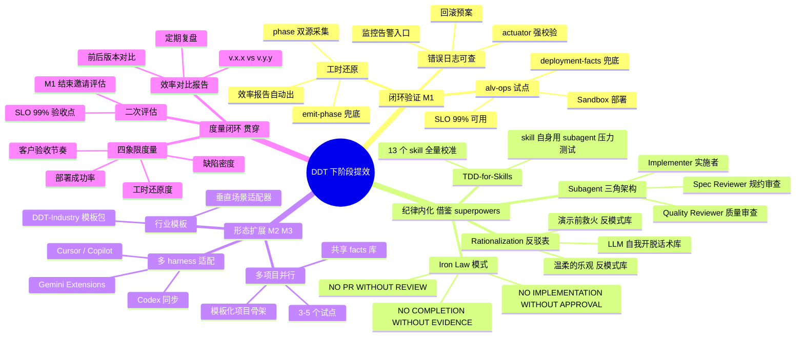

# DDT 下阶段战略汇报

> **致**：[领导]
> **自**：DDT 研发
> **日期**：2026-05-14
> **主题**：回应 B 级评价 · 澄清 DDT 价值主张 · 锁定下阶段提效路径

---

## 开场

收到您的 B 级评价，先表态：**不回避、不辩护、不滑头**。

您的三连问，我会按次序回答：

1. **为什么不直接用 AI 编程？** → 这是 DDT 存在的根本理由，先讲清。
2. **DDT 实测效果很差。** → 这是事实层面的事实，我承认；但 B 级评价的"否定性结论"我会有理有据地不接受。
3. **下一步什么计划？** → 我们已经有了 ROADMAP 四阶段，再叠加对标行业标杆 superpowers 的方法论，形成一份"既看得到对标、又看得到节奏"的下阶段提效战略。

报告共六章，约 2,500 字，含一张思维导图。看十分钟，能看完全貌。

---

## 第一章｜先回答"为什么不直接用 AI 编程？"

这是您最尖锐的一问，也是 DDT 必须每次都正面回答的问题。

**答案是：因为"直接用 AI 编程"和"DDT 编排 AI 编程"解决的是两个根本不同的问题。**

### 一句话区分

| 维度 | 直接 AI 编程 | DDT 编排 AI 编程 |
|------|-------------|-----------------|
| **场景** | 工程师一对一向 LLM 提问 | 团队/组织以 LLM 为执行单元的协作交付 |
| **类比** | 工匠手工艺 | 流水线 SOP |
| **优点** | 灵活、低门槛、即时 | 一致、可审计、可复用 |
| **断点** | 换一个工程师、换一段对话，结果不可复现 | 工程师离场也能交付，过程可追溯 |
|  |  |  |

直接用 AI 编程在**个人创作**和**原型探索**两类场景里无可替代，DDT 也从不否认这一点。

但**企业交付**面对的是另外的世界：

- 客户要 SSoT（"以哪份契约为准？"）
- 项目经理要 WBS（"任务分解到几小时？谁卡谁？"）
- 测试要可证（"验收标准在哪？覆盖率多少？"）
- 部署要可追（"上线步骤、回滚预案、监控告警在哪？"）
- 领导要度量（"前后两个版本，效率提升了多少？"）

**这五件事，没有任何一件是"直接对 LLM 说一句话"能解决的。**它们要求把工程纪律、流程治理、单一事实源、自动度量**封装成企业可复用资产**，让 LLM 在这个资产之上跑，而不是裸跑。

这正是 DDT 在做的事——它不替代 AI 编程，它**让 AI 编程在企业场景下跑得起来**。

### 行业已经为这条路线投票

不只是我们这么想。两个标杆能佐证：

1. **Anthropic 官方 plugin marketplace**——把 obra/superpowers 收录为官方推荐插件。Superpowers 是什么？是把"TDD、系统化调试、subagent 编排"这些工程纪律**封装成可被 LLM 自动调用的能力库**。它和 DDT 走的是同一条路（"封装纪律成资产"），只是 superpowers 做**通用工程纪律层**，DDT 做**数字化交付流程层**。
2. **GitHub Copilot CLI、Codex、Gemini Extensions**——都开始引入 plugin/skill 体系。这是一个**行业级共识**：单 LLM 裸跑解决不了企业问题，必须有"约束层"。

**结论**：B 级评价里"为什么不直接用 AI 编程"这个问句，**预设了一个错误前提**——它假设 DDT 和直接 AI 编程是替代关系。它们不是。直接 AI 编程是手工艺，DDT 是流水线，两者都需要。

---

## 第二章｜B 级评价：事实承认，结论反转

### 事实层面，我承认

过去 4-6 周，DDT 从 v0.4 一路冲到 v0.8/v0.9.20，发出了 30+ 次 hotfix，548 个测试用例，9 个 agent，21 个 slash command，36 个 bin 脚本——**但您在 alv-ops 这个真实试点项目上看到的实测效果，确实"演示导向"**。

具体表现：
- 演示时跑通的 demo，部署到 sandbox 后**密码硬编码**导致连不上数据库（D36 暴露）
- 前端 OpenAPI 客户端在演示前**4 个手修动作**才成功生成（D35 暴露）
- 关键阶段事件因 LLM 改写命令模板**丢失工时记录**（D34 暴露）

这些都是事实。我不为它们找借口。

### 结论层面，我不接受"演示导向"等于"路线错误"

但 B 级评价里**隐含的否定性结论**（"DDT 路线有问题，不如直接用 AI 编程"），我请求您允许我用一个**业内通行的产品成熟度模型**来重新看：

| 阶段 | 目标 | DDT 当前位置 |
|------|------|-------------|
| **MVP** | 跑得起来，能演示 | ✅ 已完成（v0.8） |
| **试点** | 在一个真实项目上跑通闭环 | ⏳ 进行中（alv-ops M1） |
| **小规模生产** | 3-5 个项目同时跑，错误可恢复 | 🔜 M2 目标 |
| **规模化** | 团队/组织级使用，可观测 | 🔜 M3 目标 |
| **行业产品** | 跨组织、跨行业模板 | 🔜 M4 目标 |

**B 级评价精确反映的是："DDT 走完了 MVP，进入了试点，但还没跑出闭环。"** 这是**事实**。

但"走完 MVP 还没跑出闭环"**不是路线错误**，而是**项目阶段**——任何一个企业级工具产品都要经过这个阶段。superpowers 在被 Anthropic 收录之前也走过同样的阶段。

**我的承诺**：在 M1 阶段结束时（约 4-6 周后），我会邀请您做一次二次评估，这次的考核点不是"演示是否华丽"，而是"alv-ops 一个完整迭代的部署可用率、错误日志可查率、工时还原度"——这是真闭环的硬指标。

---

## 第三章｜行业坐标：DDT 在地图上的哪个位置

为了让您更直观地看到 DDT 的位置，我把目前业内做"AI 编程纪律化"的三个标杆放在同一张坐标系上：

```
            行业特化 ↑
                    │
                    │       ┌─────────────┐
                    │       │     DDT     │
                    │       │ (数字化交付) │
                    │       └─────────────┘
                    │
                    │
        ┌─────────────────────┐
        │   Claude Code       │
        │ (官方 plugin 体系)  │
        └─────────────────────┘
                    │
                    │
                    │   ┌──────────────────┐
                    │   │   superpowers    │
                    │   │  (通用工程纪律)  │
                    │   └──────────────────┘
                    │
            行业中立 ↓
                    └─────────────────────────→  纪律封装度（弱→强）
```

三个观察：

1. **superpowers 已经验证了"封装纪律成资产"是对的**——v5.1.0、被 Anthropic 官方收录、94% PR 拒绝率（强守门质量）。
2. **DDT 占的位置是 superpowers 没占的位置**——行业特化（数字化交付）、流程治理（命令编排 + 审批节点）、度量闭环（工时还原、phase 事件、效率报告）。
3. **DDT 不与 superpowers 竞争，反而能借鉴它**——这是下一章的主题。

`★ Insight ─────────────────────────────────────`
- 这张坐标图最重要的不是"DDT 在哪儿"，而是"DDT 不在 superpowers 的位置"——行业特化是 DDT 的护城河，也是为什么"直接用 AI 编程"或"用 superpowers"都不能替代 DDT 的根本原因。
- 一个产品要赢，不能在"功能上比对手强"，必须**在对手不想去的位置占住**。DDT 就是占了"行业流程治理"这个 superpowers 明确不想做的位置。
`─────────────────────────────────────────────────`

---

## 第四章｜下阶段提效战略（含思维导图）

把 ROADMAP 四阶段 + superpowers 三条借鉴融合，下阶段提效的全景如下：



**这张图阐述四条主线**：

1. **闭环验证 M1**：先在 alv-ops 一个项目上跑通"部署 + 工时 + 错误日志"三件套，达到 Demo 级 SLO 99% 可用率。
2. **纪律内化（借鉴 superpowers）**：把 superpowers 调研里识别出的四个核心机制（Iron Law、Subagent 三角、Rationalization 表、TDD-for-Skills）注入 DDT，治理"LLM 自我开脱、演示导向、skill 文本无验证"三大反模式。
3. **形态扩展 M2/M3**：从 1 个项目扩到 3-5 个，从 Claude Code 扩到 Codex/Gemini/Cursor，从通用 DDT 拆出"DDT-Industry"行业模板包。
4. **度量闭环（贯穿四阶段）**：每个阶段都用四象限度量（工时还原度、缺陷密度、部署成功率、客户验收节奏）做硬性验收，杜绝"自我感觉良好"。

---

## 第五章｜三条具体执行路径（M1 这 4-6 周）

### 路径一：实战路径（最关键）

**目标**：在 alv-ops 跑通一次完整迭代，达到 SLO 99% 可用率。

**W1**：sandbox 申请 + 容器化部署清单 + deployment-facts 落地（D36 已经构建好工具，本周纯执行）
**W2**：用 DDT 的 6-phase 走一个真实需求的全流程，**关键升级**：IMPLEMENT 阶段试跑 superpowers 的 subagent 三角架构（Implementer + Spec Reviewer + Quality Reviewer），不再让单个 LLM 一气呵成
**W3**：观察生产 + 记录新反模式 + 沉淀到 Rationalization 表
**W4**：邀请您做二次评估，硬指标考核

**预期交付**：alv-ops 一个完整迭代的工时还原报告 + 部署成功率 + 错误日志可查截图 + 客户验收记录

### 路径二：内化路径（最有杠杆）

**目标**：把 superpowers 三个机制注入 DDT，让 13 个 skill 真正约束 LLM 行为。

**动作 A**：把 Iron Law + Rationalization 表写进 DDT 的 review-agent 和 docs-agent（约 0.5 天）
**动作 B**：起草 `docs/SKILL-AUTHORING.md`，规定所有 DDT skill 必须用 superpowers CSO 规则起名、写 description（"Use when..." 起首，禁工作流摘要）（约 1 天）
**动作 C**：回头校准现有 13 个 skill 的 description（约 1-2 天）

**预期交付**：13 个 skill 的"对 LLM 实际约束力"可测且可验证

### 路径三：扩展路径（最长远）

**目标**：让 DDT 不再只是"Claude Code 的插件"，而是"跨多个 AI 编程平台的行业资产"。

**动作 A**：调研 Codex CLI 的 plugin 协议（superpowers 已经支持，可作参考）
**动作 B**：把 DDT 核心 skill 抽取成"DDT-Core"，把行业特化部分抽取成"DDT-Industry"
**动作 C**：M2 阶段尝试发布 DDT-Core 到 Anthropic 官方 marketplace

**预期交付**：DDT 形态准备好接受第二个客户/第二个项目

---

## 第六章｜风险与承诺

### 我承担的风险

- **如果 M1 W4 二次评估仍然 B 级**：路线必须重新审视，我接受您的任何处置。
- **如果 superpowers 借鉴反而拖慢节奏**：我会在 W2 末就给您预警，不会等到 W4 才说"借鉴不顺利"。
- **如果 alv-ops sandbox 申请受阻**：W1 末必报，绝不私下扛着。

### 我向您承诺的节奏调整

过去 v0.9.x 一周多发版的节奏，**那是 MVP 阶段的节奏，不是试点阶段的节奏**。下阶段我会调整：

- **不再追求"演示华丽"**——能演示但不能上线的功能不再做。
- **不再追求"hotfix 数量"**——演示前打补丁不再是合格交付。
- **追求"二次评估指标"**——所有动作都向 M1 W4 那场二次评估对齐。

### 我请求您的支持

- **alv-ops sandbox 凭证申请**——这是 M1 W1 的唯一阻塞点，需要您协调。
- **二次评估的硬指标**——能否在 W1 内和您敲定 SLO 99% 的具体口径？这样 W4 我有标准对照。
- **节奏放缓的容忍**——下阶段从"一周多发"降到"两到三周一次质量门发版"，请允许这个调整。

---

## 收尾

回到您最初的三连问：

1. **为什么不直接用 AI 编程？** → 因为企业交付需要的不是"AI 写代码"，而是"AI 在工程纪律约束下交付"。DDT 解决后者，行业标杆（superpowers + Anthropic marketplace）已经为这条路投票。
2. **DDT 实测效果很差。** → 事实承认，结论反转——这不是路线错误，是项目阶段。M1 W4 的二次评估会给您硬指标答案。
3. **下一步什么计划？** → 闭环验证 + 纪律内化 + 形态扩展 + 度量闭环，四线并进。详见上文思维导图与三条执行路径。

**最后一句**：B 级评价我收下了，它对我们是一记重要的提醒——不能再活在"演示导向"的舒适区。但 DDT 这条路线我们没有走错，下阶段我们会用真闭环、硬指标、行业对标三件事，把评级抬回去。

请您允许我们用 M1 这 4-6 周来证明。

— DDT 研发，2026-05-14

---

## 附：原始引用

- DDT ROADMAP：`digital-delivery-team/ROADMAP.md`
- Superpowers 调研报告：`digital-delivery-team/docs/research/superpowers-deep-dive.md`
- DDT CHANGELOG（v0.4 → v0.9.20）：`digital-delivery-team/CHANGELOG.md`
- DDT 当前测试基数：548 用例（`tests/`）
- 实战试点项目：alv-ops（无人物流车运营服务平台）
