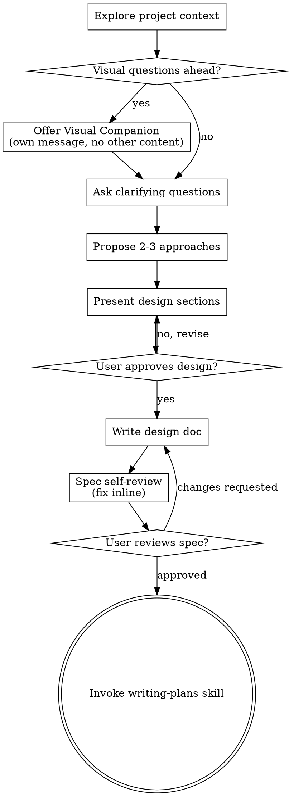

# 把想法头脑风暴成设计

通过自然的协作对话，帮助把"想法"变成完整成形的设计与 spec。

先理解当前项目背景，然后每次问一个问题来打磨想法。一旦你弄清楚要做什么，把设计呈现出来并获得用户批准。

<HARD-GATE>
在你呈现完设计、用户已批准之前，**不要**调用任何实现类 skill、不要写任何代码、不要搭任何项目脚手架、不要采取任何实现动作。**每一个项目都适用，无论它看起来多简单**。
</HARD-GATE>

## 反模式："这太简单了，不需要设计"

每个项目都要走这套流程。todo 列表、单函数的小工具、配置改动——通通要走。"简单"项目恰恰是"未审视的假设"造成最多浪费工作的地方。设计可以写得很短（真正简单的项目只需几句话），但你**必须**呈现设计并获得批准。

## 检查清单

你**必须**为下面每一项创建一个任务并按顺序完成：

1. **探索项目背景** —— 看文件、文档、近期 commit
2. **提供 Visual Companion**（如果话题会涉及视觉问题）—— 这是单独一条消息，**不要**和澄清问题混在一起。详见下文 Visual Companion 节。
3. **提问澄清** —— 每次一个，弄清目的 / 约束 / 成功标准
4. **提出 2-3 种方案** —— 含权衡与你的推荐
5. **呈现设计** —— 各章节按复杂度调整篇幅，**每完成一节都获取用户批准**
6. **写设计文档** —— 保存到 `docs/superpowers/specs/YYYY-MM-DD-<topic>-design.md` 并 commit
7. **Spec 自审** —— 就地快速检查占位符、矛盾、歧义、范围（见下文）
8. **用户评审已写好的 spec** —— 在继续之前请用户评审 spec 文件
9. **过渡到实现** —— 调用 writing-plans skill 来创建实现计划

## 流程图

**终态是调用 writing-plans。** 不要调用 frontend-design、mcp-builder 或任何其他实现类 skill。brainstorming 之后**唯一**能调用的 skill 是 writing-plans。

## 整个流程

**理解想法：**

- 先看一眼当前项目状态（文件、文档、近期 commit）
- 在问详细问题之前，先评估范围：如果需求描述了多个独立子系统（例："做一个带聊天、文件存储、计费、分析的平台"），**立刻**指出来。别在一个本应先拆解的项目上浪费问题打磨细节。
- 如果项目太大、装不进一份 spec，帮用户拆成子项目：哪些是独立件、互相怎么关联、应当按什么顺序构建？然后挑第一个子项目走正常的设计流程。每个子项目各走一遍 spec → plan → 实现 的循环。
- 对范围合适的项目，每次只问一个问题来打磨
- 尽量出选择题，开放题也可以
- **一条消息只问一个问题** —— 一个话题需要更深入时，拆成多个问题
- 把焦点放在"理解"上：目的、约束、成功标准

**探索方案：**

- 提出 2-3 种不同方案，附权衡
- 用对话方式给出选项、附你的推荐与理由
- 把你的推荐放在最前面、说清楚为什么

**呈现设计：**

- 一旦你认为已经弄清楚要做什么，把设计呈现出来
- 各节按复杂度调整篇幅：简单的几句话就行，复杂细腻的可以写到 200-300 字
- 每讲完一节问一句"目前看着对不对"
- 覆盖：架构、组件、数据流、错误处理、测试
- 如果哪里讲不通，做好回头澄清的准备

**为"隔离与清晰"而设计：**

- 把系统拆成更小的单元，每个有清晰目的、通过明确接口通信、且能独立理解与测试
- 对每个单元，应该能回答：它做什么？怎么用？依赖什么？
- 别人不读内部实现就能知道它做什么吗？你能改内部而不破坏使用方吗？答不上来，边界就还得修。
- 更小、边界明确的单元也方便你协作——你对"能一次放进上下文的代码"推理得更好，文件聚焦时编辑也更可靠。文件一变大，往往就是它"做了太多"的信号。

**在现有代码库工作：**

- 提改动之前先看清当前结构。沿用既有模式。
- 当现有代码存在影响本次工作的问题（比如文件过大、边界不清、职责纠缠），把**针对性**改进作为设计的一部分——一个好工程师会顺手改进自己正在工作的代码。
- 不要提议无关的重构。专注于服务当前目标。

## 设计完之后

**文档化：**

- 把已验证的设计（spec）写到 `docs/superpowers/specs/YYYY-MM-DD-<topic>-design.md`
  - （用户自定义的 spec 位置偏好优先）
- 若有 elements-of-style:writing-clearly-and-concisely skill 可用，用它
- 把设计文档 commit 到 git

**Spec 自审：**
写完 spec 文档后，用新鲜的眼睛再看一遍：

1. **占位符扫描：** 有 "TBD"、"TODO"、未完成的章节或含糊的需求吗？修掉。
2. **内部一致性：** 哪两节自相矛盾？架构是否与功能描述一致？
3. **范围检查：** 是否聚焦到能用一份实现计划盖住？还是得继续拆？
4. **歧义检查：** 是否有需求可被两种方式理解？若是，挑一种、显式写清。

发现问题就地修。不必再走一轮 review——改完往下走即可。

**用户评审关卡：**
spec 自审循环通过后，请用户评审已写好的 spec，再继续：

> "Spec written and committed to `<path>`. Please review it and let me know if you want to make any changes before we start writing out the implementation plan."

等用户回复。如果他们要求修改，做改动并重跑 spec 自审循环。只有用户批准后才继续。

**实现：**

- 调用 writing-plans skill 来创建详细的实现计划
- 不要调用任何其它 skill。writing-plans 是下一步。

## 核心原则

- **一次一个问题** —— 不要一次抛一堆问题压垮用户
- **优先选择题** —— 比开放题更容易回答
- **YAGNI 用到底** —— 把所有设计里"用不上的功能"都剔掉
- **探索替代方案** —— 永远先提 2-3 种方案再敲定
- **增量验证** —— 呈现设计、获得批准，然后再继续
- **保持灵活** —— 哪里讲不通就回头澄清

## Visual Companion

一个基于浏览器的辅助工具，用于在头脑风暴中展示 mockup、图表和可视化选项。它是一个**工具**——不是模式。接受 Companion 只意味着"它对那些受益于视觉表达的问题可用"，**不**意味着每个问题都走浏览器。

**提供 Companion：** 当你预见接下来的问题会涉及视觉内容（mockup、布局、图表）时，**只问一次**征求同意：

> "Some of what we're working on might be easier to explain if I can show it to you in a web browser. I can put together mockups, diagrams, comparisons, and other visuals as we go. This feature is still new and can be token-intensive. Want to try it? (Requires opening a local URL)"

**这个提议必须单独一条消息。** 不要与澄清问题、上下文总结或任何其他内容合并。这条消息**只**包含上面那句提议，别的不要。等用户回复后再继续。如果他们拒绝，就走纯文本头脑风暴。

**逐问题决策：** 即使用户接受了，**仍要为每个问题**判断该用浏览器还是终端。判据：**用户"看见"会比"读到"更容易理解吗？**

- **走浏览器** 用于本身就是"视觉"的内容 —— mockup、线框、布局对比、架构图、并列视觉设计
- **走终端** 用于文本类内容 —— 需求问题、概念性选择、权衡列表、A/B/C/D 文本选项、范围决策

一个"关于 UI 话题"的问题不自动是"视觉问题"。"在这个语境下 personality 是什么意思？"是概念问题——用终端。"哪个向导布局更好？"是视觉问题——用浏览器。

如果用户同意启用 Companion，**先**读完详细指南再继续：
`skills/brainstorming/visual-companion.md`
