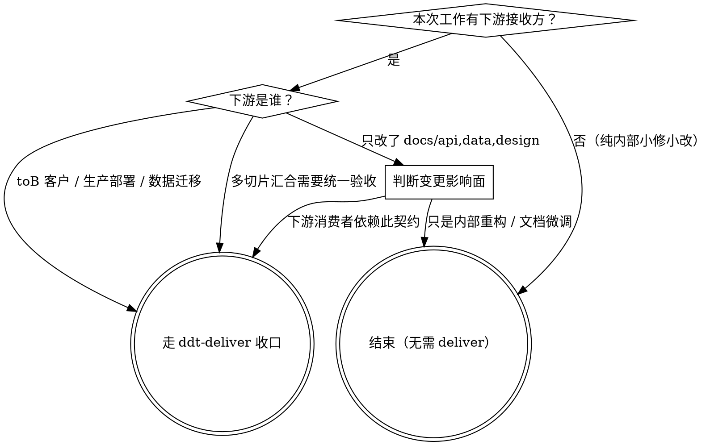

# ddt-deliver — 按需收口

## 何时使用

收口不是每次工作的必须步骤。当工作**确实需要交付签收**时再用：

- 多个实现切片汇合，需要统一收口的验收记录
- toB 客户验收场景，需要正式交付包与接收确认
- 部署到生产环境，需要部署指南与回滚方案
- 数据迁移，需要迁移验证与回滚证据
- `docs/api/`、`docs/data/`、`docs/design/` 发生变更，需要更新说明
- 客户交付说明、演示脚本
- 降低保障级交付（断网/受限基建）需要显式标注

**小修小改不强制走本 skill**——合并一个 bug fix、更新文档、补测试，通常直接完成即可。

## 是否要走收口（决策流）



判据靠**问"下游是谁、要什么"**，不靠 LLM "感觉这次比较正式"。如果说不出具体的接收方与他们要的证据，多半就是没下游、直接结束。

## 按需产物

根据实际场景选择需要的产物，不强制全套：

### 验收记录（`docs/verification/`）

记录验收过程与结论：
- 哪些场景经过人工或自动化验证，以什么方式
- 验收通过的证据（测试结果、截图、日志片段）
- 已知局限与边界

### 交付包（`docs/delivery/`）

根据交付类型选择：
- **README / 发布说明**：面向接收方的项目定位、快速上手、版本变更
- **部署指南**：环境矩阵、依赖版本、部署步骤、回滚指引
- **演示脚本**：seed 数据命令、演示步骤、预期输出、已知限制
- **客户交付说明**：面向 toB 客户的接收确认材料

### AI 效能 ROI 报告（按需）

由 `ddt-report.mjs` 产出，读 `.ddt/metrics/*.jsonl` 与 `.ddt/decisions.jsonl`，渲染 `docs/efficiency-report.md`。需要度量数据时按需运行：`ddt-report.mjs`。

## 降低保障级交付

断网/受限基建下若完整验收未跑通：
- `.ddt/decisions.jsonl` 记一条**署名 waiver**（含基建原因），把 JSON 对象通过 stdin 喂给 `ddt-decisions-append.mjs`：

  ```bash
  cat <<'EOF' | ddt-decisions-append.mjs
  {"type":"waiver","scope":"delivery","signer":"<owner>","reason":"<基建原因，例：CI 断网，无法跑 E2E>","missing-evidence":["<缺哪些证据>"],"accepted-by":"<接收方>"}
  EOF
  ```

  脚本读 stdin、自动补 `ts`、append 到 `.ddt/decisions.jsonl`。字段名是 body 属性（不是 CLI flag），消费端机判。

- 交付文档**显式标注"本交付为降低保障级"**并列明哪些证据缺失
- 接收方须知情接受

**绝不假装跑过**。waiver 入账是补救通道，不是绕道——下次能跑通时把缺的证据补上、再追加一条 `{"type":"waiver-cleared","supersedes":"<前一条 ts>"}` 入账。

## 常见反模式（自我警觉清单）

| 反模式 | 为什么不通过 | 正确做法 |
|---|---|---|
| 小修小改也走完整 deliver | "正式感"不是触发条件；无下游接收方就没收口对象 | 决策图问"下游是谁、要什么"——说不出就跳过 |
| 没跑完验收，但交付文档写"已验证" | 假断言污染下游决策 | `ddt-verification` 没过就不写 verified；走 waiver 通道 |
| 部署后才补部署指南 | 指南是给下次/别人用的，不是事后追认 | 部署前把回滚步骤跑一遍并写入指南 |
| 用"差不多就行"省掉回滚验证 | 回滚是生产部署的安全底，不验证等于裸奔 | 部署前先在 staging 跑一次回滚演练，证据入 `docs/verification/` |
| 把 waiver 写在 PR 描述或 spec 里 | 账本即真相，下游消费端无法机判 | 通过 stdin 喂 `ddt-decisions-append.mjs` 入账 `.ddt/decisions.jsonl` |
| 多切片汇合时各自交付，不统一收口 | 接收方拿到一堆碎片，无法整体验收 | 在收口阶段聚合多切片证据，产一份统一 `docs/verification/<release>.md` |
| 把 `ddt-report.mjs` 当强制环节 | 度量是被动采集，按需出报告；没数据就别凑 | 只在需要 AI 效能 ROI 时跑；数据稀少时如实标注 |
| waiver 一直挂着不清理 | 降低保障级是临时通道，长期挂 = 习惯性绕道 | 能跑通时追加 `{"type":"waiver-cleared","supersedes":"<前 ts>"}` |

## 在 DDT 里的位置

- **上游**：`ddt-verification`（验证证据）、`ddt-requesting-review` / `ddt-receiving-review`（评审证据）—— 收口收的是这些已就位的产物，不是从零生成
- **本回路**：按下游需要产 `docs/verification/` / `docs/delivery/` 子集，waiver 入 `.ddt/decisions.jsonl`，效能报告（按需）入 `docs/efficiency-report.md`
- **下游**：交付即终态——返回主线（开始下一个 brief / 进入下一切片 brainstorming）或结束当前需求
- **度量工具**：`ddt-report.mjs`（被动采集，按需产报告）
- **留痕工具**：`ddt-decisions-append.mjs`、`ddt-changelog-append.mjs`（stdin 喂 JSON 对象，不接 CLI flag）
