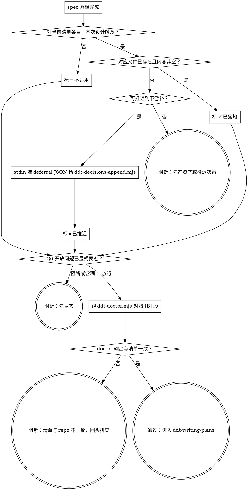

# ddt-design-checkpoint — 设计落地闸（资产就位，不是答完表）

**它不是设计生成器**——设计本身在 ddt-brainstorming/spec 阶段已产出。
**它不是 ddt-brainstorming 替代**——发散与设计探索在 ddt-brainstorming 里做。
**它不是判断题答卷**——七问每个"是"都必须有**对应的真实落地资产**就位，否则闸不算通过。

## 为什么这道闸必须真的落地

`ddt-writing-plans` 的输入应该是**已锁定的设计**。若契约、数据模型、架构决策仅以"七问答表"形式停在 spec 末尾，会发生三件事：

- plan 基于纸面承诺推任务（"实现 X 接口"，但 X 的契约根本不存在）；
- 实现阶段在没有锁定契约的情况下自由发挥；
- reviewer 阶段没有锁定的契约可依，**证据先于断言**的原则被破坏。

所以闸的判据不是"答完七问"，而是"资产真的存在或推迟决策真的入账"。

## 七问完成清单

设计推进到下一落地阶段（单 brief → `ddt-writing-plans`，或大需求 → 逐切片深做）之前，**逐条核对每条的状态**：

1. **`docs/api/` 资产已就位？** 本次设计若新增或修订 API 契约（OpenAPI / RPC schema / 接口签名），对应文件已写入 `docs/api/<name>.{yaml,md}`，内容含调用方/被调方约定。
2. **`docs/data/` 资产已就位？** 若涉及数据模型新增/修订/迁移，对应文件已写入 `docs/data/<name>.md`，内容含字段、约束、迁移路径。
3. **`docs/design/` 资产已就位？** 凡本次涉及**非平凡设计**的——架构图 / 模块拓扑 / 业务流程 / 跨模块时序 / 难点算法（推导、复杂度、边界）/ 重点复杂功能（状态机、并发协议、事务模型、复杂条件分支）/ 数据流（"怎么流"，与 `docs/data/` 的"长什么样"互补）/ 选型 ADR / 跨模块边界决策——都已写入 `docs/design/<topic>.md`，内容含设计意图与理由。
   - **"非平凡"判据**（任一命中即必须落地）：动了架构、模块边界、跨模块流程；新增 / 改了数据流；时序敏感的算法或并发协议；状态机或复杂条件分支；选了一个有替代的方案（选型）。
   - **合法跳过的极少数情况**（清单之外都不算）：纯重构（不动架构 / 流程 / 算法）、纯依赖升级、纯测试补强、仅文档微调、仅 UI 文本 / 样式微调（且不触及交互流程）。
   - `docs/design/` 不是 ADR 专属目录——ADR 只是一种形态。**阅读代码读不出来的设计意图，都属设计留痕**。
4. **`.ddt/decisions.jsonl` 已追加？** 凡需要持久化为团队决策的条目，已经 `ddt-decisions-append.mjs` 追加（写在 spec 里不算）。
5. **`.ddt/changelog.jsonl` 已追加？** 凡构成显著变更的事项，已经 `ddt-changelog-append.mjs` 入账。
6. **开放问题已表态？** 未解决冲突 / 待协同确认项已写明（spec 内或 `docs/design/<topic>-open-questions.md`），且**显式判断为"放行（带已知开放项）"还是"阻断（暂不进 writing-plans）"**——含糊不算表态。
7. **可推进闸：** 上面 1-5 每条为 ✅（已落地）/ ⏸（已记 deferral）/ ➖（不适用），且 Q6 表态为"放行"，方可进 `ddt-writing-plans`。

## 三种合法状态（其它状态都不通过）

每条清单项**只能**处于以下三种状态之一：

- **✅ 已落地**：对应文件已存在并包含设计内容（不是空壳，不是占位）。
- **⏸ 已推迟**：当下无法完整落地（需协同方确认 / 信息未齐），**已用 `ddt-decisions-append.mjs` 追加一条决策**，body 显式标 `deferral` + 推迟原因 + 何时/何条件下补。这条 decision 本身就是闸的证据。
- **➖ 不适用**：本次设计**完全不触及**该方面。这个判定门槛**很高**——尤其对 `docs/design/`：只有清单第 3 问的"合法跳过极少数情况"才算，**不可类比其它问的不适用就给 `docs/design/` 也打 ➖**。"本次没有新架构决策"**不算**——业务流程 / 时序 / 算法 / 复杂功能 / 选型也算设计留痕。
  - 类比示例（合法 ➖）：纯前端样式微调不动 `docs/api/` → ✅ 可 ➖；同一改动若**触及交互流程或状态机** → 不可 ➖，`docs/design/` 必须就位。

**不允许的状态**：
- 在 spec 末尾写"影响 docs/api：是"但 `docs/api/<name>` 不存在且无 deferral decision——这是**纸面承诺**，闸不通过。
- 因为"本次没有 ADR"就给 `docs/design/` 打 ➖——`docs/design/` 不只装 ADR，业务流程 / 时序 / 算法 / 复杂功能设计都属设计留痕。

判断现在是哪种状态，靠**查文件系统**（文件在不在、内容空不空）和**查 `.ddt/decisions.jsonl`**（deferral 条目在不在），不靠 LLM 主观回忆。

## 在什么粒度运行

- **单 brief（默认）**：一份 design spec 进 `ddt-writing-plans` 前过。
- **大需求级**：`ddt-large-requirement` 把大需求拆成架构 + 切片方案后、逐片深做之前过——**仅当**有跨切片、无单 brief 归属的全局判断（总体架构、技术栈、实时通道选型、跨切片业务流程、跨切片时序等）时才过，且**只落全局层**（全局架构图 / 跨切片流程图 / 跨切片时序 / 选型 ADR 落 `docs/design/`，全局决策落 `.ddt/decisions.jsonl`）。各切片的局部 API/data 契约与局部设计留痕**留给各 brief 自己的 Checkpoint**，不在此预支。

## 前端分流

含前端的切片，先看 `docs/design/frontend/` 状态：

- **空且无 opt-out decision** → 先 `ddt-design-source` 外部整体设计一次（粒度按项目判断）；
- **非空** → 按 bundle 实现；
- **有 opt-out decision** → 用设计系统直接实现。

详见 `ddt-design-source`。

## 通过自检

Checkpoint 通过**前**，跑一次 `ddt-doctor.mjs` 看 [B] 段——doctor 知道当前 repo 里哪些路径已就位。把七问清单的 ✅ 项对照 doctor 输出确认文件真的存在；把 ⏸ 项对照 `.ddt/decisions.jsonl` 末尾几条确认 deferral 真的入账。这是最后一道客观自检。

路径按内容含义命名，没有固定模板，但**必须真的存在**且**内容非空**。

## 闸口判定流（每条都过一遍）



deferral JSON 形状示例（`ddt-decisions-append.mjs` 读 stdin、自动补 `ts`）：

```bash
cat <<'EOF' | ddt-decisions-append.mjs
{"type":"deferral","scope":"<api|data|design>","item":"<具体决策点>","reason":"<协同方未确认 / 信息未齐>","resolve-by":"<何时/何条件下补>"}
EOF
```

## 常见反模式（自我警觉清单）

| 反模式 | 为什么不通过 | 正确做法 |
|---|---|---|
| 在 spec 末尾写"七问答表"，每条答"是/否"就推进 | 答表不是资产 | 每个"是"要么产出文件，要么写 deferral decision |
| "本次改动较小，写答表就够了" | "小"是逃逸口；只要进 writing-plans 就过同一道闸 | 真的小到清单全为 ➖，自然零产出；不是简化版闸 |
| "契约还要和上游确认，先进 plan 再说" | plan 会基于不存在的契约推任务 | 显式写 deferral decision，或暂不进 plan |
| "设计写在 spec 里也算落地" | spec 是脉络，不是契约；下游 reviewer 找不到锁定点 | 资产单独落 `docs/api,data,design` 对应路径 |
| 创建空文件 `docs/design/<topic>.md` 占位 | 空壳骗通过 | 文件必须含决策内容；doctor 只查存在性，内容空否要自检 |
| "本次没有架构决策（ADR），所以 `docs/design/` 打 ➖ 不适用" | `docs/design/` 不是 ADR 专属——业务流程 / 时序 / 算法 / 复杂功能设计也都属设计留痕 | 对照第 3 问"非平凡"判据：动了流程 / 时序 / 算法 / 状态机 / 选型，**任一命中**就必须落地 |
| "代码看就行了，不用写设计文档" | 设计意图（为什么这样架构 / 流程 / 时序 / 算法选型）**阅读代码读不出来**；future reader / 接手人 / reviewer 拿不到关键上下文 | 凡阅读代码读不出来的设计意图，都写进 `docs/design/<topic>.md` |
| "前面已经定过架构了，本次微调不用补设计" | 设计是流的——本次的变体也是设计意图的一部分；不留痕，下次又得重新推导一次 | 增量设计留痕（如 `docs/design/<topic>-v2.md` 或在原文件增量追加）也是 ✅ 已落地 |
| 自我授权"我已经做过 Checkpoint 了" | 没有客观证据 | 通过判据是文件存在 + deferral 入账，不是 LLM 主观判断 |
| 把 ddt-brainstorming 输出的"影响面分析"段当成 Checkpoint 完成 | brainstorming 产的是设计 spec，不是落地资产 | spec 里的影响面分析是 Checkpoint 的**输入**，不是其**输出** |
| "已在 spec 里答完七问，invoke 是复读 / 浪费 token" | spec 七问是 LLM 主观判断；checkpoint 是文件系统 + `.ddt/decisions.jsonl` 客观核验。**两件事，不重复** | 用 `ls` / `tail` / `ddt-doctor.mjs` 拿真实状态，不靠回放七问表 |

## 与其他 skill 的关系

- 上游：`ddt-brainstorming`（产设计 spec）
- 下游：`ddt-writing-plans`（Checkpoint 通过后进入）
- 落地工具：`ddt-decisions-append.mjs`、`ddt-changelog-append.mjs`
- 路径权威：`ddt-doctor.mjs` [B] 段
