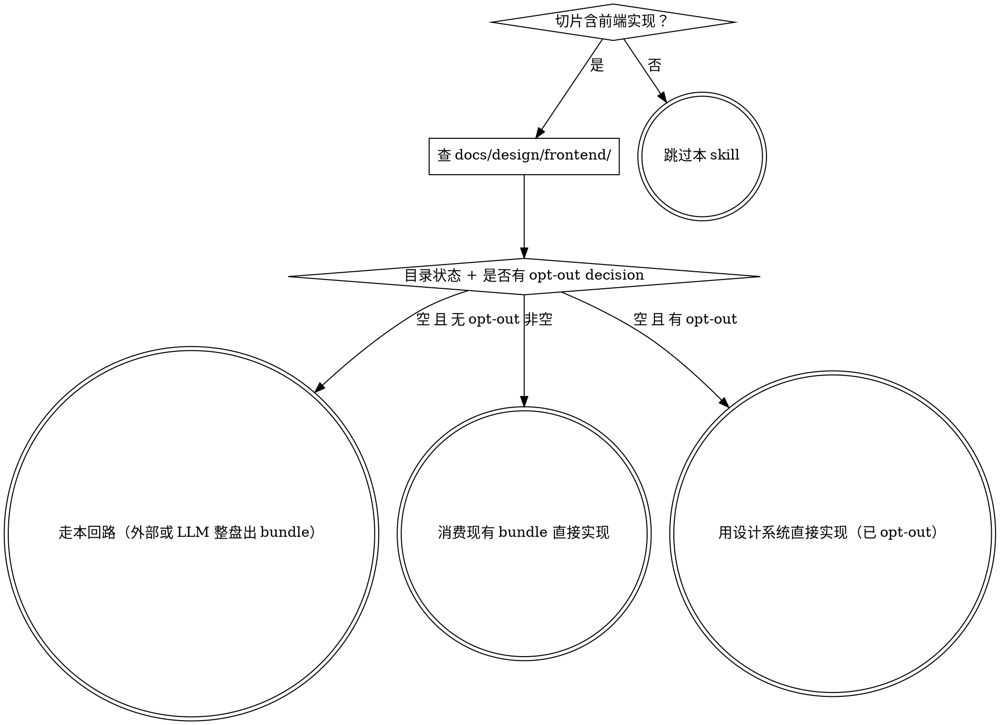

# ddt-design-source — 前端审美的外部收敛回路

## 何时进入这道回路

每个**含前端实现**的切片，进入实现前先过本闸——它决定走"自己整盘出 bundle"、"消费已有 bundle"还是"用设计系统直接实现"。判据靠**查文件系统**（`docs/design/frontend/` 目录非空？）和**查 `.ddt/decisions.jsonl`**（opt-out decision 在不在？），不靠 LLM 主观回忆。



## 整体设计一次，出一个 bundle

前端实现分散在多切片，但设计若每切片各自出，拼起来视觉不一致。所以**整体设计一次**，产出一个连贯 bundle——**一套设计系统（色彩 / 导航菜单 / 组件 / 间距统一）+ 各页面**，切片只消费。色彩、菜单、组件都出自这一套，所以切片间不会跑偏：**一致性靠"整盘一套系统"，不靠逐页对齐**。哪怕外部回路把系统调得风格迥异、结构大改，它仍是整套一起变、仍是一套。粒度——整盘一次 / 按 UI 域 / 设计系统先行——按项目判断。

全部前端同出这一套语言，**含 CRUD、表格、后台**：设计系统常为竞争力定制过原生风格，现成组件库会与它不一致。感知型页面（大屏、动态可视化、首屏）逐页 bespoke，contract-driven 页面套这套系统装配标准的列表 / 表单 / 详情——都从这一套来，不回退现成组件库。

## 在外部做是推荐，不是强制

审美/UX 是感知-交互问题，不是文本推理——在外部 AI 设计工具（v0/figma/claude-design）里实时渲染、人来判定，审美保真最好，所以**推荐**走外部。但要求的只是"整盘出一个连贯 bundle"，**谁设计的不重要**：外部工具出的、或 LLM 自己整盘出的，落 `docs/design/frontend/` 后一视同仁。

LLM 自做也行——前提是**认真做一次整盘**（一套统一语言、设计系统 + 各页），不是每切片抓个组件库就码：那是本回路要避免的病，换 LLM 来犯不会变好。

## 回路（按所用工具调整，不是死仪式）

1. **Export** — 给外部工具**问题与约束，不给解法**。给：页面清单 + 各页意图（来自 requirements/briefs）+ 状态规范（loading/empty/error/success、响应式、无障碍）+ 领域硬需求（如告警一眼可见、地图坐标系）+ 调性方向与**仅真正固定的**品牌锚点。**留白给它发挥**：解析后的色阶 / 字体 / 布局 / 组件样式是它的交付物，别在文字里先做完——那会把竞争力和辨识度封顶在你已想到的范围里。留白只碰两处、**绝不碰一致性**：签名页（大屏 / 首屏）给足意图、布局留空让它探索；CRUD 一句"套同一套系统的标准列表 / 表单 / 详情"即可。设计只依赖这些，**不依赖契约**——契约（`docs/api`/`docs/data`）在各 brief 的 Design Checkpoint 才出，留到 Reconcile。
2. **外部回路** — 人在工具里渲染、迭代到满意（LLM 自做时：LLM 整盘生成、你 review 到满意）。DDT 不替代这一步。
3. **Ingest** — 产物（代码 / URL / figma）原样落 `docs/design/frontend/<bundle-root>/`，**外部工具自带的 handoff 入口文件**（给 coding agent 的协议说明，告诉它这套 bundle 如何消费——典型指示如"直接读 HTML/CSS、follow imports、不截图"）**保留不动**——它是源权威。**不在 `docs/design/frontend/` 写项目侧导览 markdown**（不写 `SOURCE.md` / `INDEX.md` / `OVERVIEW.md` 等），原因与判据见 `using-ddt` 的"含前端的 brief：bundle 的 handoff 入口 = 唯一权威"段。如果外部工具没自带 handoff 入口文件（罕见），人工补一份**最小**的 README，第一行明示协议（直接读源码 / 不截图 / follow imports）。`.ddt/changelog.jsonl` 记一条 ingest 事件，含 bundle 根路径和 handoff 入口路径。
4. **Reconcile** — 把定稿与它牵动的两头对齐。**向上**：外部回路常改掉 Export 时的假设（这正是让人判定的价值）；凡推翻了上游前提（受理书的范式 / 范围假设等），记一条带 `supersedes` 的 decision 写明覆盖了什么——不私改上游文档（IL-4），账本即真相。**向下**：各切片落地时把设计的字段 / 状态与该切片 Design Checkpoint 产出的 `docs/api`/`docs/data` 契约对齐，不一致就改契约或调设计。

## bundle 是前端的视觉真相

- **位置** `docs/design/frontend/`：目录固定，内部文件自由命名；非空即"有 bundle"（可机判，不靠眼看 `docs/design/`）。
- **消费**：各前端切片直接消费 bundle 实现——**入口是 bundle 自带的 handoff 入口文件**（外部工具产的协议说明），不是项目侧再造的导览。切片进入实现前必读这份 handoff，再按它的指引自由消费源码（详见 `using-ddt`）。切片的 design spec 是"建什么"的计划——**引用** bundle 源码路径、补数据 / 状态 / 集成，不替代也不转译它（转成文字就丢了视觉）。
- **opt-out（决策必须入账，不能只在脑子里 / spec 里）**：没有前端 / 前端极简到不值得整盘设计时，把一个 JSON 对象通过 stdin 喂给 `ddt-decisions-append.mjs`（脚本读 stdin、自动补 `ts`、append 到 `.ddt/decisions.jsonl`）：

  ```bash
  cat <<'EOF' | ddt-decisions-append.mjs
  {"type":"opt-out","scope":"frontend-design","reason":"前端极简（如纯命令行工具的简单 docs 页），不值得整盘设计","note":"据此跳过本回路；切片实现可直接套设计系统或 inline 样式"}
  EOF
  ```

  字段语义（`type` / `scope`）是 body 的属性、由消费端机判，不是 CLI flag——脚本本身只读 stdin 写文件，不解析 flag。

  写在 spec / brief / PR 描述里**都不算** opt-out——账本即真相，下游消费者机判 `.ddt/decisions.jsonl` 末尾是否有 `{"type":"opt-out","scope":"frontend-design",...}` 条目。

  据此判定：目录空且无此 decision = 走本回路（外部或 LLM 自做）；非空 = 消费；有此 decision = 用设计系统直接实现。**"没有外部工具" 不属 opt-out**——LLM 自做整盘即可。

## 常见反模式（自我警觉清单）

| 反模式 | 为什么不通过 | 正确做法 |
|---|---|---|
| 每切片各抓组件库就码 | 拼起来视觉不一致，整套语言被稀释 | 整盘一次出一套设计系统（色彩 / 菜单 / 组件 / 间距），切片只消费 |
| "用 LLM 一句话生成首页 CSS" 当作整盘设计 | 没有设计系统，下个页面又得重来；色彩 / 组件无锚 | LLM 自做也要整盘一次，产出连贯 bundle（系统 + 各页） |
| 现成组件库直接套（含 CRUD / 表格 / 后台）| 设计系统常为竞争力定制过原生风格，组件库与它不一致 | 全部前端套同一套语言，CRUD / 表格 / 后台也按本套系统装配 |
| "没有外部工具，所以跳过本回路" | 工具不是关键，"整盘一次"才是；LLM 自做也算 | LLM 整盘出一个 bundle 落 `docs/design/frontend/`；不要写 opt-out decision |
| 把 opt-out 决定写在 spec / brief / PR 描述里就算 | spec 是脉络，不是账本；下游消费端无法机判 | 把 `{"type":"opt-out","scope":"frontend-design",...}` 通过 stdin 喂给 `ddt-decisions-append.mjs` 入账 |
| Export 时把色阶 / 字体 / 布局 / 组件样式都写死 | 把竞争力和辨识度封顶在你已想到的范围 | 给问题与约束，不给解法；解析后的视觉是它的交付物 |
| 让契约绑死设计（"先出 docs/api，再做设计"）| 契约（`docs/api` / `docs/data`）在各 brief Checkpoint 才出 | 设计阶段只依赖意图与状态规范，契约留 Reconcile 阶段对齐 |
| 外部回路推翻上游假设但不入账 | 账本即真相，下游消费者拿到漂移的视觉 | 推翻上游前提时写一条带 `supersedes` 的 decision 显式覆盖 |
| 创建空目录 `docs/design/frontend/` 占位 | 空目录也算"非空"，会误导下游切片去消费空 bundle | 真有 bundle 才落地；没做就保持目录不存在，让下游进入本回路 |
| ingest 时在 `docs/design/frontend/` 写一份项目侧导览 markdown（`SOURCE.md` / `INDEX.md` / `OVERVIEW.md` 等）| 文件类型偏见：LLM 见项目自家 markdown 入口本能当 spec、停在转译层不读真正源码 | bundle 自带的 handoff 入口（外部工具产的）是唯一权威；项目侧不写任何导览 markdown 覆盖它（原理见 `using-ddt`）|

## 在 DDT 里的位置

- **上游**：`大需求变小` 给出页面清单（来自 requirements/briefs）
- **本回路**：出 bundle 落 `docs/design/frontend/`（视觉真相），bundle 自带的 handoff 入口是切片消费唯一权威（不写项目侧导览，原理见 `using-ddt`）
- **下游**：各前端 brief 的 `ddt-brainstorming` 引用 bundle handoff 入口与本切片相关源文件出该切片 spec → `ddt-design-checkpoint` 过闸 → `ddt-writing-plans` / `ddt-subagent-driven` 按协议读源码实现 → `ddt-requesting-review`
- **账本**：本回路完成后 `.ddt/changelog.jsonl` 记一条 `frontend-design-bundle-ingested`（含 bundle 根 + handoff 入口路径）；opt-out 走 `.ddt/decisions.jsonl`
