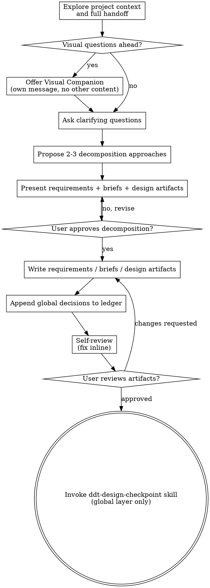

# Decomposing Large Requirements Into Briefs

Help turn a large, multi-module requirement into a fully formed set of `docs/requirements/` + `docs/briefs/` + global-layer design artifacts under `docs/design/` + global decisions through natural collaborative dialogue.

Start by understanding the current project context and the full handoff materials, then ask questions one at a time to refine the scope, module boundaries, and decomposition. Once you understand what's in (and out of) scope, present the requirements acceptance, the brief list, and the global-layer design artifacts, and get user approval.

<HARD-GATE>
Do NOT invoke any implementation skill, write any code, scaffold any project, or take any implementation action until you have presented the requirements + briefs + global-layer design artifacts and the user has approved them. This applies to EVERY large requirement regardless of perceived simplicity. Do NOT invoke ddt-brainstorming on individual briefs until the global-layer ddt-design-checkpoint passes.
</HARD-GATE>

## What Goes Into `docs/design/` At The Global Layer

`docs/design/` is not an "ADR-only" folder. It holds **anything about the design intent that you cannot read off the code**, at the global / cross-slice layer:

- **Architecture** — module topology, layered structure, dependency graph
- **Cross-slice business flows** — how a user / data / event travels across multiple briefs
- **Cross-slice sequence diagrams** — message ordering, timing-sensitive interactions, async coordination
- **Hard-problem algorithms** — derivation, complexity analysis, boundary conditions for non-trivial algorithms that span slices
- **Complex feature designs** — state machines, concurrency protocols, transaction models, complex conditional branches
- **Selection ADRs** — tech stack, realtime channel, auth model, persistence model — the "we chose X over Y because Z" records
- **Cross-cutting decisions** — anything that constrains multiple briefs simultaneously

The naming is free (file per topic, e.g. `architecture.md`, `payment-flow.md`, `event-ordering.md`, `auth-selection-adr.md`); the folder is fixed.

**Brief-local design artifacts** (algorithms, state machines, sequence diagrams scoped inside a single brief) belong to that brief's own checkpoint — not here.

## Anti-Pattern: "This Is Too Big To Slice"

Every large requirement goes through this process. A 20-module platform, a "rewrite the whole thing", a customer dump of 300 user stories — all of them. Large requirements are where unexamined module boundaries and skipped architecture / cross-slice flow / cross-slice timing decisions cause the most wasted work downstream. The requirements + briefs + global-layer design artifacts can be short (a few briefs and a one-page architecture sketch for moderate requirements), but you MUST produce them and get approval before any brief starts its own subchain.

The mirror anti-pattern: **"This Is Too Simple To Need Decomposition"** — every brief gets its own ddt-brainstorming. If the input feels like one focused brief already, exit this skill and go to ddt-brainstorming directly. But when in doubt, decompose. A premature giant spec is far costlier to unwind than an extra brief.

## Checklist

You MUST create a task for each of these items and complete them in order:

1. **Explore project context and full handoff** — check files, docs, recent commits, AND read every page of the handoff materials (PRD, meeting minutes, API docs, customer spec). Don't sample.
2. **Offer visual companion** (if architecture / module boundaries / system diagrams will help) — this is its own message, not combined with a clarifying question. See the Visual Companion section below.
3. **Ask clarifying questions** — one at a time, understand scope/non-scope, module boundaries, stakeholders, cross-slice constraints, success criteria
4. **Propose 2-3 decomposition approaches** — different axes (by business capability / by data flow / by user role / by deployment unit), with trade-offs and your recommendation
5. **Present requirements + brief list + global-layer design artifacts** — in sections scaled to their complexity, get user approval after each section
6. **Write requirements acceptance** — save to `docs/requirements/<name>.md` and commit
7. **Write brief list** — one file per brief, save to `docs/briefs/<id>-<name>.md` and commit
8. **Write global-layer design artifacts** — one file per topic under `docs/design/` (architecture, cross-slice flows, cross-slice sequence, hard-problem algorithms, selection ADRs — see "What Goes Into docs/design/" above for the full inventory). The folder is non-empty by the end of this step **unless** the requirement is a pure refactor / pure dependency upgrade / pure test top-up / pure doc tweak (the four exceptions). "No new architecture decisions" is **not** an exception — flows, sequences, algorithms, and complex features all count.
9. **Append global decisions** — stdin JSON to `ddt-decisions-append.mjs` for each global-layer decision (tech stack, module boundary, realtime channel, etc.)
10. **Self-review** — quick inline check for placeholders, contradictions, ambiguity, brief granularity, design-artifact completeness (see below)
11. **User reviews written artifacts** — ask user to review requirements + briefs + design artifacts before proceeding
12. **Transition to global-layer design checkpoint** — invoke ddt-design-checkpoint skill to gate the global layer before each brief starts its own subchain

## Process Flow



**The terminal state is invoking ddt-design-checkpoint at the global layer** (global-layer design artifacts + cross-slice decisions only — each brief's local API/data contracts and local design artifacts are NOT pre-committed here; they're for each brief's own checkpoint). Do NOT invoke ddt-brainstorming on individual briefs, ddt-writing-plans, or any other implementation skill directly. After the global-layer gate passes, briefs run their own subchains independently.

## The Process

**Understanding the requirement:**

- Check out the current project state first (files, docs, recent commits)
- Then read the **full** handoff materials — every page, every section. Skimming a 30-page PRD and asking questions reveals scope misunderstandings later that cost briefs to be redone.
- Before asking detailed questions, assess shape: who are the stakeholders, what's the explicit scope statement (if any), what's flagged as out-of-scope, what's ambiguous on scope?
- If the handoff materials themselves contradict each other or have undefined sections, flag this immediately. Don't paper over it with assumptions.
- For appropriately-scoped large requirements, ask questions one at a time to refine the scope and decomposition
- Prefer multiple choice questions when possible, but open-ended is fine too
- Only one question per message - if a topic needs more exploration, break it into multiple questions
- Focus on understanding: scope/non-scope, module boundaries, cross-slice dependencies, global decisions (tech stack, realtime channels, auth model), success criteria

**Exploring decomposition approaches:**

- Propose 2-3 different decomposition approaches with trade-offs (different axes: business capability / data flow / user role / deployment unit)
- Present options conversationally with your recommendation and reasoning
- Lead with your recommended option and explain why
- The right decomposition is the one where each brief is independently consumable by ddt-brainstorming — not too small (ceremonial overhead drowns progress) and not too big (back to the giant-spec problem)

**Presenting the decomposition:**

- Once you believe you understand the requirement, present the decomposition
- Scale each section to its complexity: a few sentences if straightforward, up to 200-300 words if nuanced
- Ask after each section whether it looks right so far
- Cover: requirements acceptance (scope, non-scope, stakeholders, success criteria), brief list (each brief's single goal and receiver), global-layer design artifacts (overall architecture, tech stack, module boundaries, realtime channels, cross-slice business flows, cross-slice sequence diagrams, hard-problem algorithms, selection ADRs, other cross-slice decisions)
- Be ready to go back and clarify if a brief boundary doesn't make sense

**Design for isolation and clarity:**

- Break the requirement into briefs that each have one clear purpose, communicate through well-defined inter-brief interfaces, and can be implemented and reviewed independently
- For each brief, you should be able to answer: what does it deliver, who consumes its output, and what does it depend on from other briefs?
- Can someone understand what a brief produces without reading the other briefs? Can you change a brief's internals without breaking the briefs that depend on it? If not, the boundaries need work — usually that means promoting a shared concern into a global-layer design artifact under `docs/design/`.
- Smaller, well-bounded briefs are also easier for the downstream subchain to handle — ddt-brainstorming reasons better about briefs it can hold in context at once, and writing-plans produces cleaner implementation plans when briefs are focused. When a brief grows large or branches into multiple goals, that's often a signal it should be split.

**Working in existing codebases:**

- Explore the current structure before proposing the decomposition. Follow existing module boundaries where they make sense.
- Where the existing structure has problems that affect the large requirement (e.g., a module that's grown too large, unclear boundaries between subsystems, tangled cross-cutting concerns), include targeted restructuring as part of the global-layer design artifacts — the way a good architect improves the structure they're working in.
- Don't propose unrelated refactoring. Stay focused on what serves the current requirement.

## After the Decomposition

**Documentation:**

- Write the validated artifacts to their canonical paths:
  - `docs/requirements/<name>.md` — requirements acceptance (scope, non-scope, stakeholders, success criteria)
  - `docs/briefs/<id>-<name>.md` — one file per brief (single goal, single receiver, inter-brief dependencies, expected outputs)
  - `docs/design/<topic>.md` — global-layer design artifacts. **One file per topic, naming free, folder fixed.** Typical files: `architecture.md` (module topology / layered structure), `<feature>-flow.md` (cross-slice business flow), `<event>-sequence.md` (cross-slice message ordering), `<algorithm>.md` (hard-problem algorithm with derivation), `<feature>-state-machine.md`, `<choice>-adr.md` (selection records). See the "What Goes Into `docs/design/`" section above for the full inventory.
  - (User preferences for these paths override the defaults)
- Use elements-of-style:writing-clearly-and-concisely skill if available
- Commit the artifacts to git

**Global decisions to ledger:**

For each global-layer decision (tech stack, module boundary, realtime channel selection, auth model, etc.) that needs to be machine-readable by downstream briefs, append it to `.ddt/decisions.jsonl` via stdin JSON:

```bash
cat <<'EOF' | ddt-decisions-append.mjs
{"type":"global-decision","scope":"<arch|tech-stack|module-boundary|realtime|auth|...>","item":"<具体决策点>","rationale":"<理由>","supersedes":"<被覆盖的前一条 ts，可缺省>"}
EOF
```

The design artifacts under `docs/design/` are the narrative (with diagrams, derivations, sequences); the ledger is the machine-judgable truth. Both must exist — narrative without ledger means downstream briefs can't programmatically check; ledger without narrative means a future reader has no rationale.

**Self-Review:**
After writing the artifacts, look at them with fresh eyes:

1. **Placeholder scan:** Any "TBD", "TODO", incomplete sections, or vague requirements? Fix them.
2. **Internal consistency:** Do any sections contradict each other? Does the brief list cover the requirements acceptance fully (and only that)? Does the architecture support every brief's needs?
3. **Brief granularity check:** Is each brief independently consumable by ddt-brainstorming? Too big (multiple goals) → split. Too small (single function / single file) → merge.
4. **Scope/non-scope check:** Is everything in the handoff materials either in a brief OR explicitly listed as non-scope? Silent omissions cause arguments later.
5. **Ambiguity check:** Could any requirement be interpreted two different ways? If so, pick one and make it explicit.

Fix any issues inline. No need to re-review — just fix and move on.

**User Review Gate:**
After the self-review loop passes, ask the user to review the written artifacts before proceeding:

> "Requirements, briefs, and global-layer design artifacts written and committed to `<paths>` (including `docs/design/<topic>.md` for architecture / flows / sequences / algorithms / selection ADRs as needed). Global decisions appended to `.ddt/decisions.jsonl`. Please review them and let me know if you want to make any changes before we move to the global-layer design checkpoint."

Wait for the user's response. If they request changes, make them and re-run the self-review loop. Only proceed once the user approves.

**Implementation:**

- Invoke the ddt-design-checkpoint skill to gate the **global layer only** — global-layer design artifacts (architecture / cross-slice flows / cross-slice sequences / hard-problem algorithms / selection ADRs) + cross-slice decisions in the ledger. Each brief's local API/data contracts and local design artifacts are NOT pre-committed here; they're for each brief's own checkpoint when that brief runs its subchain.
- Do NOT invoke any other skill. ddt-design-checkpoint is the next step. After the global-layer gate passes, each brief runs its own independent subchain (ddt-brainstorming → ddt-design-checkpoint → ddt-writing-plans → implementation → review).

## Key Principles

- **One question at a time** - Don't overwhelm with multiple questions
- **Multiple choice preferred** - Easier to answer than open-ended when possible
- **YAGNI ruthlessly** - Remove unnecessary briefs and unnecessary scope from the requirements acceptance
- **Explore alternatives** - Always propose 2-3 decomposition approaches before settling
- **Incremental validation** - Present requirements + briefs + design artifacts section by section, get approval before moving on
- **Be flexible** - Go back and re-slice when a brief boundary doesn't make sense
- **Global layer only at this gate** - Don't pre-commit each brief's local API/data contracts here. Those belong to each brief's own checkpoint.

## Visual Companion

A browser-based companion for showing architecture diagrams, module-boundary visualizations, brief-dependency graphs, and side-by-side decomposition options during large-requirement decomposition. Available as a tool — not a mode. Accepting the companion means it's available for questions that benefit from visual treatment; it does NOT mean every question goes through the browser.

**Offering the companion:** When you anticipate that upcoming questions will involve visual content (architecture diagrams, module boundaries, brief-dependency graphs, decomposition comparisons), offer it once for consent:
> "Some of what we're working on might be easier to explain if I can show it to you in a web browser. I can put together architecture diagrams, module-boundary visualizations, brief-dependency graphs, and decomposition comparisons as we go. This feature is still new and can be token-intensive. Want to try it? (Requires opening a local URL)"

**This offer MUST be its own message.** Do not combine it with clarifying questions, context summaries, or any other content. The message should contain ONLY the offer above and nothing else. Wait for the user's response before continuing. If they decline, proceed with text-only decomposition.

**Per-question decision:** Even after the user accepts, decide FOR EACH QUESTION whether to use the browser or the terminal. The test: **would the user understand this better by seeing it than reading it?**

- **Use the browser** for content that IS visual — architecture diagrams, module-boundary maps, brief-dependency graphs, side-by-side decomposition comparisons
- **Use the terminal** for content that is text — scope questions, conceptual choices, tradeoff lists, A/B/C/D text options, brief-granularity decisions

A question about an architecture topic is not automatically a visual question. "What does this module own conceptually?" is a conceptual question — use the terminal. "Which module-boundary layout works better?" is a visual question — use the browser.

If they agree to the companion, read the detailed guide before proceeding:
`skills/ddt-large-requirement/visual-companion.md`
