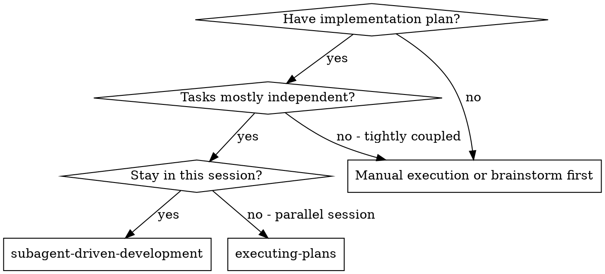
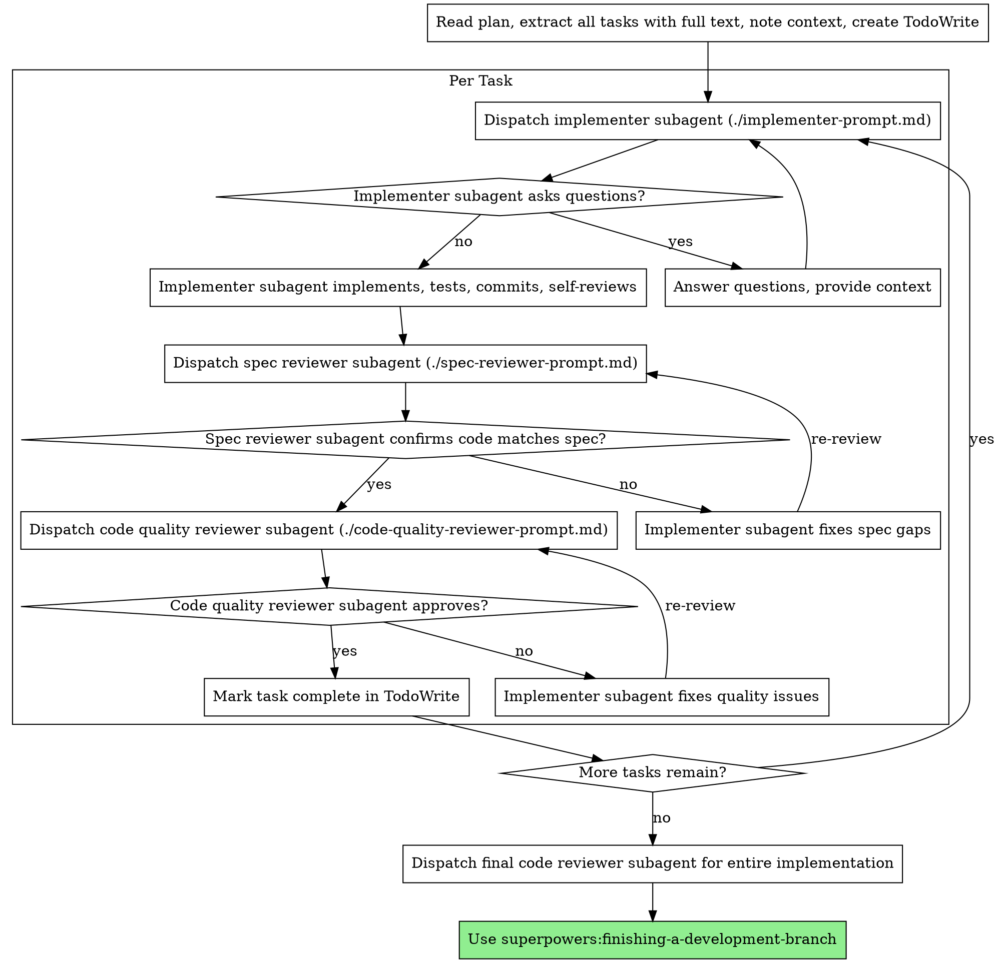

# Subagent 驱动的开发（Subagent-Driven Development）

执行计划的方式：**每个任务派一个全新 subagent**，每个任务结束后做**两阶段评审**——先 spec 合规审，再代码质量审。

**为什么用 subagent：** 你把任务委派给上下文隔离的专门 agent。通过精心构造它们的指令与上下文，确保它们聚焦并完成任务。它们**不应**继承你这次会话的上下文或历史——你只精确投喂它需要的东西。这同时保护了你自己用来做协调工作的上下文。

**核心原则：** 每任务一个新 subagent + 两阶段评审（先 spec、再质量）= 高质量、快速迭代

**连续执行：** 在任务之间**不要**回头与你的人类搭档确认。把计划里的所有任务一次性执行完。**唯一**可以停下的理由是：BLOCKED 状态你解不开、有歧义确实导致无法推进、或所有任务完成。"是否继续？"这样的回问和"进度小结"都是在浪费搭档的时间——他们让你执行计划，那就执行。

## 何时使用



**vs. Executing Plans（另开会话）：**
- 同一会话（无需切换上下文）
- 每个任务一个新 subagent（无上下文污染）
- 每个任务后两阶段评审：先 spec 合规，再代码质量
- 迭代更快（任务之间不用等人）

## 流程



## 模型选择

每个角色用**能扛住任务的最便宜模型**，以节省成本、提升速度。

**机械式实施任务**（孤立函数、明确 spec、1-2 个文件）：用便宜快速的模型。当 plan 写得清楚时，多数实施任务都是机械式的。

**集成与判断任务**（多文件协同、模式匹配、debug）：用标准模型。

**架构、设计、评审任务：** 用最强的可用模型。

**任务复杂度信号：**
- 涉及 1-2 个文件且 spec 完整 → 便宜模型
- 涉及多个文件且有集成顾虑 → 标准模型
- 需要设计判断或对代码库的广泛理解 → 最强模型

## 处理 Implementer 的状态

Implementer subagent 会汇报四种状态之一。分别处理：

**DONE：** 进入 spec 合规审。

**DONE_WITH_CONCERNS：** 实施者完成了工作但留了疑虑。审之前先读疑虑。如果疑虑关于"正确性或范围"，先处理再审；如果是观察性的（例如"这个文件越来越大了"），记录下来，照常进入审。

**NEEDS_CONTEXT：** 实施者需要你没提供的信息。补上缺失上下文，重新派发。

**BLOCKED：** 实施者完不成。评估阻碍：
1. 如果是上下文问题：补充上下文，用同一模型重派
2. 如果任务需要更强推理：换更强模型重派
3. 如果任务过大：拆成更小片
4. 如果是计划本身错了：升级给人类搭档

**绝对不要**忽略升级，也不要在没有任何改变的情况下强迫同一模型重试。subagent 说卡住了，**某处一定要变**。

## Prompt 模板

- `./implementer-prompt.md` —— 派发实施者 subagent
- `./spec-reviewer-prompt.md` —— 派发 spec 合规审 subagent
- `./code-quality-reviewer-prompt.md` —— 派发代码质量审 subagent

## 示例工作流

```
You: I'm using Subagent-Driven Development to execute this plan.

[Read plan file once: docs/superpowers/plans/feature-plan.md]
[Extract all 5 tasks with full text and context]
[Create TodoWrite with all tasks]

Task 1: Hook installation script

[Get Task 1 text and context (already extracted)]
[Dispatch implementation subagent with full task text + context]

Implementer: "Before I begin - should the hook be installed at user or system level?"

You: "User level (~/.config/superpowers/hooks/)"

Implementer: "Got it. Implementing now..."
[Later] Implementer:
  - Implemented install-hook command
  - Added tests, 5/5 passing
  - Self-review: Found I missed --force flag, added it
  - Committed

[Dispatch spec compliance reviewer]
Spec reviewer: ✅ Spec compliant - all requirements met, nothing extra

[Get git SHAs, dispatch code quality reviewer]
Code reviewer: Strengths: Good test coverage, clean. Issues: None. Approved.

[Mark Task 1 complete]

Task 2: Recovery modes

[Get Task 2 text and context (already extracted)]
[Dispatch implementation subagent with full task text + context]

Implementer: [No questions, proceeds]
Implementer:
  - Added verify/repair modes
  - 8/8 tests passing
  - Self-review: All good
  - Committed

[Dispatch spec compliance reviewer]
Spec reviewer: ❌ Issues:
  - Missing: Progress reporting (spec says "report every 100 items")
  - Extra: Added --json flag (not requested)

[Implementer fixes issues]
Implementer: Removed --json flag, added progress reporting

[Spec reviewer reviews again]
Spec reviewer: ✅ Spec compliant now

[Dispatch code quality reviewer]
Code reviewer: Strengths: Solid. Issues (Important): Magic number (100)

[Implementer fixes]
Implementer: Extracted PROGRESS_INTERVAL constant

[Code reviewer reviews again]
Code reviewer: ✅ Approved

[Mark Task 2 complete]

...

[After all tasks]
[Dispatch final code-reviewer]
Final reviewer: All requirements met, ready to merge

Done!
```

## 优势

**vs. 手动执行：**
- subagent 天然按 TDD 走
- 每任务上下文是新的（不会混淆）
- 并发安全（subagent 之间不会相互干扰）
- subagent 可以提问（**开工前**与**进行中**都行）

**vs. Executing Plans：**
- 同一会话（无需交接）
- 持续推进（不必等人）
- 评审 checkpoint 自动发生

**效率提升：**
- 无需读文件的开销（controller 直接给完整文本）
- controller 精确策展所需上下文
- subagent 一开始就拿到完整信息
- 问题在动手前就浮现（而不是动完才暴露）

**质量关卡：**
- 自审在交接前抓问题
- 两阶段评审：先 spec 合规，再代码质量
- 评审循环确保修复**真的**起效
- spec 合规防止"做多"或"做少"
- 代码质量保证实现"做得好"

**代价：**
- subagent 调用更多（每任务 = implementer + 2 reviewer）
- controller 做更多前置准备（先一次性把所有任务抽出来）
- 评审循环增加迭代次数
- 但能尽早抓问题（比事后调试便宜）

## 红旗

**永远不要：**
- 在没有用户明确同意时，在 main/master 分支上开始实现
- 跳过任何评审（spec 合规 **或** 代码质量）
- 在仍有未修问题时继续往下走
- 并行派发多个实施者 subagent（会冲突）
- 让 subagent 自己去读 plan 文件（应当直接给它完整文本）
- 跳过"铺垫上下文"（subagent 必须明白任务在系统中的位置）
- 忽略 subagent 的提问（**先回答**再让它开始）
- 在 spec 合规上"差不多就行"（spec reviewer 发现问题 = 没完工）
- 跳过评审循环（reviewer 发现问题 = implementer 修 = 再评审）
- 让 implementer 自审顶替正式评审（两者都需要）
- **在 spec 合规还没 ✅ 时就启动代码质量审**（顺序错）
- 任一评审仍有未决问题时就推进到下一个任务

**如果 subagent 提问：**
- 清楚、完整地回答
- 必要时再补上下文
- 不要催它进入实现

**如果 reviewer 发现问题：**
- 由 implementer（同一个 subagent）修
- reviewer 再审
- 反复直到通过
- 不要跳过"再审"

**如果 subagent 任务失败：**
- 派发一个修复 subagent，给具体指令
- 不要手动去修（会污染上下文）

## 集成

**必备工作流 skill：**
- **superpowers:using-git-worktrees** —— 保证有隔离的工作区（创建或验证已存在）
- **superpowers:writing-plans** —— 创建本 skill 所执行的计划
- **superpowers:requesting-code-review** —— reviewer subagent 用的代码评审模板
- **superpowers:finishing-a-development-branch** —— 任务全部完成后收尾开发

**subagent 应使用：**
- **superpowers:test-driven-development** —— 每个任务里 subagent 按 TDD 走

**替代工作流：**
- **superpowers:executing-plans** —— 用于"另开会话"执行，而不是同会话执行
