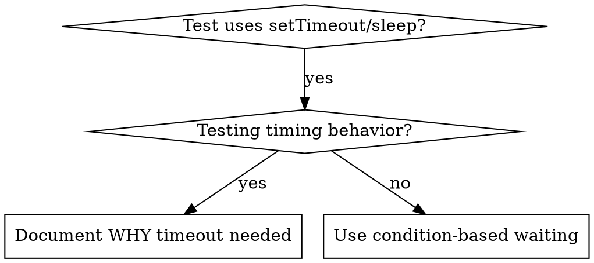

# 基于条件的等待（Condition-Based Waiting）

## 概述

不稳定的测试常常靠"猜时间"——加点任意延迟。这会埋下 race condition：测试在快机上通过，在压力或 CI 下就失败。

**核心原则：** 等你**真正在意的那个条件**，不要等"我猜要多久"。

## 何时使用



**适合使用的场景：**
- 测试里有任意延迟（`setTimeout`、`sleep`、`time.sleep()`）
- 测试 flaky（有时过有时挂）
- 并发跑测试时超时
- 等待异步操作完成

**不适合：**
- 测试本身就是在测时序行为（debounce、throttle 间隔）
- 如果用到任意 timeout，永远要写**为什么**

## 核心模式

```typescript
// ❌ BEFORE: Guessing at timing
await new Promise(r => setTimeout(r, 50));
const result = getResult();
expect(result).toBeDefined();

// ✅ AFTER: Waiting for condition
await waitFor(() => getResult() !== undefined);
const result = getResult();
expect(result).toBeDefined();
```

## 速查模式

| 场景 | 模式 |
|----------|---------|
| 等事件 | `waitFor(() => events.find(e => e.type === 'DONE'))` |
| 等状态 | `waitFor(() => machine.state === 'ready')` |
| 等数量 | `waitFor(() => items.length >= 5)` |
| 等文件 | `waitFor(() => fs.existsSync(path))` |
| 复合条件 | `waitFor(() => obj.ready && obj.value > 10)` |

## 实现

通用轮询函数：
```typescript
async function waitFor<T>(
  condition: () => T | undefined | null | false,
  description: string,
  timeoutMs = 5000
): Promise<T> {
  const startTime = Date.now();

  while (true) {
    const result = condition();
    if (result) return result;

    if (Date.now() - startTime > timeoutMs) {
      throw new Error(`Timeout waiting for ${description} after ${timeoutMs}ms`);
    }

    await new Promise(r => setTimeout(r, 10)); // Poll every 10ms
  }
}
```

完整实现见本目录 `condition-based-waiting-example.ts`，含从真实调试场景中沉淀下来的领域辅助函数（`waitForEvent`、`waitForEventCount`、`waitForEventMatch`）。

## 常见错误

**❌ 轮询太快：** `setTimeout(check, 1)` —— 烧 CPU
**✅ 修法：** 每 10ms 轮询

**❌ 没 timeout：** 条件永远不成立时会死循环
**✅ 修法：** 永远带上 timeout，附清晰的错误信息

**❌ 数据过期：** 把状态缓存在循环外
**✅ 修法：** 在循环里调用 getter 拿最新数据

## 什么时候"任意 timeout"是对的

```typescript
// Tool ticks every 100ms - need 2 ticks to verify partial output
await waitForEvent(manager, 'TOOL_STARTED'); // First: wait for condition
await new Promise(r => setTimeout(r, 200));   // Then: wait for timed behavior
// 200ms = 2 ticks at 100ms intervals - documented and justified
```

**要求：**
1. 先等触发条件
2. 基于**已知**时序（不是猜）
3. 写注释说**为什么**

## 真实战果

来自一次调试（2025-10-03）：
- 修了 3 个文件里的 15 个 flaky 测试
- 通过率：60% → 100%
- 执行时间：快了 40%
- 不再有 race condition
