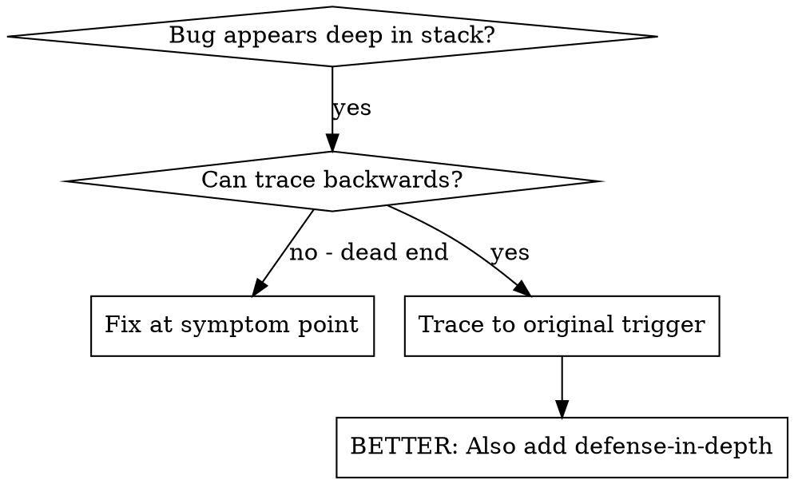
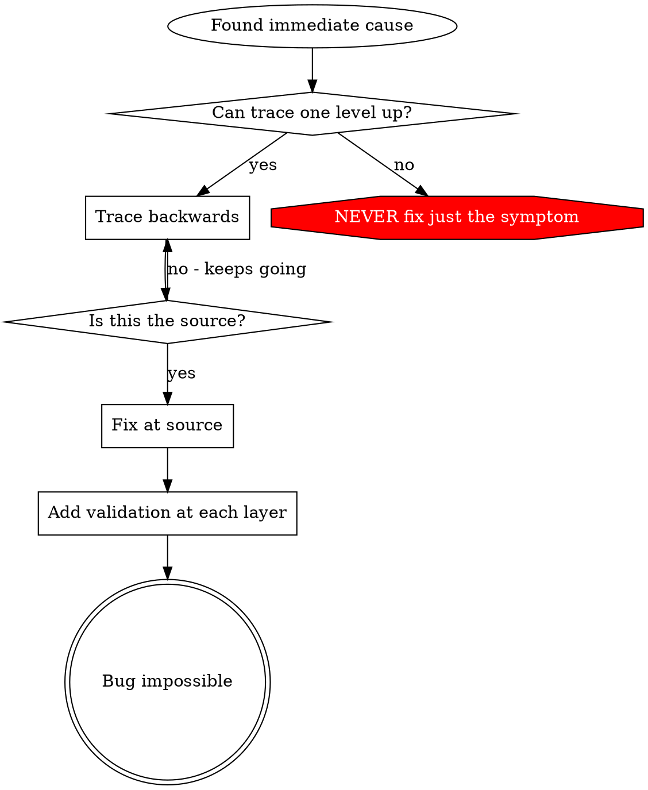

# 根因追溯（Root Cause Tracing）

## 概述

Bug 常常**冒头**在调用栈的深处（git init 跑在错的目录、文件创建在错位置、数据库以错路径打开）。你的直觉是"在错误冒头的地方修"，但那只是治标。

**核心原则：** 沿调用链**反向**追溯，找到最初的触发点，再在源头修。

## 何时使用



**适用场景：**
- 错误发生在执行深处（而不是入口）
- 调用栈很长
- 不知道非法数据从哪里产生
- 需要定位是哪个测试 / 哪段代码触发了问题

## 追溯流程

### 1. 观察症状
```
Error: git init failed in ~/project/packages/core
```

### 2. 找直接原因
**哪段代码**直接**导致它？**
```typescript
await execFileAsync('git', ['init'], { cwd: projectDir });
```

### 3. 问：谁调用了它？
```typescript
WorktreeManager.createSessionWorktree(projectDir, sessionId)
  → called by Session.initializeWorkspace()
  → called by Session.create()
  → called by test at Project.create()
```

### 4. 继续往上追
**传了什么值？**
- `projectDir = ''`（空字符串！）
- 空字符串作 `cwd` 会被解析为 `process.cwd()`
- 那正是源码目录！

### 5. 找到最初触发点
**空字符串从哪儿来？**
```typescript
const context = setupCoreTest(); // Returns { tempDir: '' }
Project.create('name', context.tempDir); // Accessed before beforeEach!
```

## 加 stack trace

当你没法手动追溯时，加探针：

```typescript
// Before the problematic operation
async function gitInit(directory: string) {
  const stack = new Error().stack;
  console.error('DEBUG git init:', {
    directory,
    cwd: process.cwd(),
    nodeEnv: process.env.NODE_ENV,
    stack,
  });

  await execFileAsync('git', ['init'], { cwd: directory });
}
```

**关键：** 测试里用 `console.error()`（不要用 logger——可能不输出）

**跑起来并抓日志：**
```bash
npm test 2>&1 | grep 'DEBUG git init'
```

**分析 stack trace：**
- 看测试文件名
- 找出触发调用的行号
- 找规律（同一个测试？同一个参数？）

## 找出"哪个测试在污染环境"

如果某现象只在测试时出现，但你不知道是哪个测试：

用本目录下的二分脚本 `find-polluter.sh`：

```bash
./find-polluter.sh '.git' 'src/**/*.test.ts'
```

它一个一个跑测试，第一个污染者出现就停下。具体用法见脚本。

## 真实示例：空 projectDir

**症状：** `.git` 被建到了 `packages/core/`（源码目录）

**追溯链：**
1. `git init` 跑在 `process.cwd()` ← cwd 参数是空
2. WorktreeManager 被传了空 projectDir
3. Session.create() 传了空字符串
4. 测试在 beforeEach 之前访问了 `context.tempDir`
5. setupCoreTest() 初始返回 `{ tempDir: '' }`

**根因：** 顶层变量初始化时访问了空值

**修法：** 把 tempDir 改成 getter，在 beforeEach 之前访问会抛错

**同时加纵深防御：**
- 第 1 层：Project.create() 校验目录
- 第 2 层：WorkspaceManager 校验非空
- 第 3 层：NODE_ENV 守卫拒绝 tmpdir 之外的 git init
- 第 4 层：git init 前打 stack trace 日志

## 关键原则



**永远不要只修错误冒头的地方。** 反向追溯到最初的触发点。

## Stack trace 小贴士

**在测试里：** 用 `console.error()` 而不是 logger —— logger 可能被屏蔽
**在操作前打：** 在危险操作**之前**打日志，而不是出错之后
**带上上下文：** 目录、cwd、环境变量、时间戳
**抓栈：** `new Error().stack` 给出完整调用链

## 真实战果

来自一次调试（2025-10-03）：
- 5 层追溯找到根因
- 在源头修（getter 校验）
- 加了 4 层防御
- 1847 个测试全过，零污染
