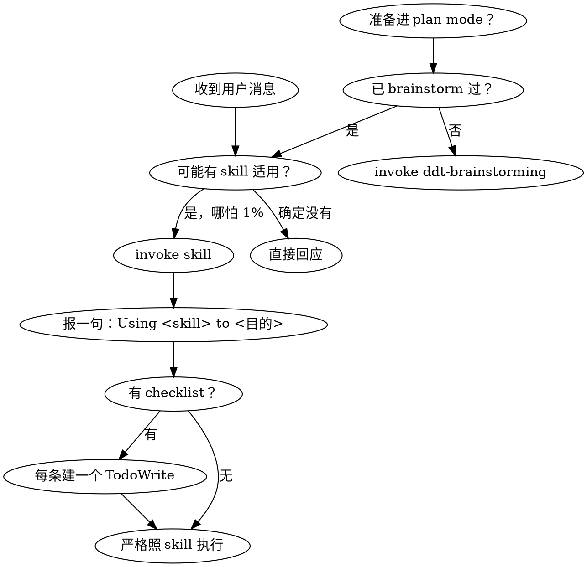

<SUBAGENT-STOP>
If you were dispatched as a subagent to execute a specific task, skip this skill.
</SUBAGENT-STOP>

# using-ddt（DDT 取向）

DDT = superpowers 工程纪律基底 + 四项治理增强。vendoring 同款 skill（命名 `ddt-*`），独立运行，**DDT 与 superpowers 二选一**。主链路：`ddt-brainstorming → ddt-design-checkpoint → ddt-writing-plans → implement → review`。
你能读到这段 = SessionStart inject 在主 agent 工作；subagent **不**接收 inject——dispatch prompt 需主 agent 传递关键纪律（见 `ddt-subagent-driven`）。

> **命名空间裁决**：本会话装的是 DDT，所有 invoke 走 `disciplined-delivery-toolkit:ddt-*`——用户口语提"superpowers 流程"也指本套 vendored skill。

## 四项治理增强（按需用，非强制路由）

- **大需求先变小** → `ddt-large-requirement` 拆 `docs/requirements/` + `docs/briefs/` + 全局层设计留痕，再逐 brief 走子链路。
- **小问题用主链路做深** → 直接 `ddt-brainstorming` 起头。
- **设计进计划前过闸** → `ddt-design-checkpoint`。
- **需要交付时再收口** → `ddt-deliver`（按需）。

## skill 纪律（DDT 力量的来源，最高优先级）

DDT 没有拦截 hook、没有强制层；纪律完全靠**让正确的 skill 真的被 invoke**。

<EXTREMELY-IMPORTANT>

任何回应或动作之前，先 invoke 相关或被点名的 skill。哪怕只有 1% 可能某 skill 适用，必须先 invoke 检查——发现不适用再放弃。

有 skill 适用，**你没有选择权，必须用它**：不可商量、不可绕过。

</EXTREMELY-IMPORTANT>

优先级：**用户显式指令 > skill / 本取向 > 默认**。用户指令说的是 **WHAT 不是 HOW**——"加个 X""修个 Y"不豁免工作流；只有用户**显式**说"别用 TDD / 跳过 brainstorming"才豁免。

**反 self-cert**：在 spec / plan / 评论里抄 checklist 自答 ✅ **不算** invoke。因为① skill 会演进，invoke 才拿当前版；② skill 按情境追问改流程，自答替代不了；③ 答 ✅ 常要产真实产物（`docs/api/`、测试、决策记录），写进 spec 只是承诺。

### 触发点（中招即停，先 invoke 再动手）

- "一整包"需求（多模块 / 跨人 / PRD-纪要-批量 API 文档 / 用户说"大需求"）→ `ddt-large-requirement` 把需求变小，再对每个 brief 走 `ddt-brainstorming`
- 想"造东西"（建功能 / 加能力 / 改行为 / 起项目 / 起切片，单 brief 尺寸）→ `ddt-brainstorming`。**第一步永远是它**，不是直接进 plan / 翻代码 / 问澄清——哪怕脑里有完整方案也先 invoke
- 撞 bug / 测试失败 / 异常行为 → `ddt-systematic-debugging`
- 进前端实现前 → `ddt-design-source`（外部 AI 设计工具整盘收敛成 bundle，落 `docs/design/frontend/`）
- 消费另一切片 / 外部 provider 接口（REST / WS / 事件 / 数据）前 → 先核**真 provider 源**（见"兑现守恒"）
- 写实现代码前 → `ddt-tdd`
- 拆 spec / 计划 → `ddt-writing-plans`；执行计划 → `ddt-subagent-driven` 或 `ddt-executing-plans`
- spec 要进 writing-plans → 先过 `ddt-design-checkpoint`（自答清单不算）
- 声明"完成 / 通过 / 修好了" → 先 `ddt-verification`（证据先于断言）
- 收 / 发 review → `ddt-receiving-review` / `ddt-requesting-review`

进入某 skill 后按结尾指示**接力 invoke 下一个**——主链路这样自动串起来。

### 别给自己找借口（Red Flags）

| 念头 | 现实 |
|---|---|
| "简单问题" / "不算任务" / "先做这一件" | 问题、动作都是任务，先 check skill |
| "先补上下文 / 先探代码 / 先看 git" | skill check 在这些之前；skill 会告诉你怎么探 |
| "不至于动用正式 skill" / "杀鸡用牛刀" | 简单会变复杂，有对应 skill 就用 |
| "这感觉挺有产出的" | 无纪律的瞎忙浪费时间 |
| "我记得这 skill 讲啥" | skill 演进，invoke 读当前版 |
| "答完 checkpoint 清单" / "答 ✅ 就够了" | 答完表 ≠ invoke 过；✅ 是承诺，不是产出 |
| "有 bundle / 有契约 doc 就算就位" | 存在 ≠ 兑现——bundle 是视觉真相非实现证据，契约 doc 会漂移于真 provider |
| "右尺寸 = 这次可不走流程" | 右尺寸给**精力分配**（哪些环节按需开），不给**纪律**开洞——开了的环节就走 skill |

### skill 优先级与刚柔

多 skill 都适用：**流程 skill 先**（brainstorming / debugging 定怎么入手），**实现 skill 后**。
skill 自报刚柔：**刚性**（TDD、debugging）严格照做；**柔性**（模式类）按情境调整。

## 决策流

## 三种入口（解释，非强制路由）

1. **局部想法** → 主链路：做 X→`ddt-brainstorming`，撞 bug→`ddt-systematic-debugging`。重构 / 补测试 / 性能 / 探索都走这条。
2. **大需求** → `ddt-large-requirement` 拆小（requirements + briefs + 全局设计留痕），过大需求级 checkpoint 后逐 brief 走子链路。
3. **brief 驱动** → brief → brainstorm → checkpoint → writing-plans → implement → review。

implementation 对象可以是文档 / 契约 / 设计 / 测试，不必是代码。**右尺寸给精力分配**（选哪些环节、产物多深），**不给 skill 纪律开洞**。

## 兑现守恒：设计锁定靠真相被锚定，不靠产物存在（跨 skill 纲领）

**存在 ≠ 兑现**：设计被锁定，是它碰到的每种真相都锚在真实之物上，而非"该产的文件在盘上"。三种真相跨 skill 跨阶段生效，操作细节落 `ddt-design-checkpoint`：

1. **视觉真相 = bundle handoff 源权威**。前端 bundle 自带的 handoff 入口是消费**唯一入口**，实现前必读、按它消费源码。项目侧**不造** `SOURCE.md` / `INDEX.md` 当导览（LLM 见 markdown 入口会停在转译层、不读真源）。
2. **数据真相 = provider 真源**。消费别人接口前对**真源码 / 真样本**核对，**不是**脑补 / 旧 doc / 自写 stub；真 backend 跑不起就读 in-repo 源贴签名。mock 派生自真样本并标来源，标 `ASSUMED` = 自证警报。reviewer 抓到契约对不上 = **红旗级** → 全量契约复核，不是补 stub 消 404。
3. **职责真相 = 上游派的活不许静默蒸发**。每过一道边界（brief→spec→plan→implement）上游职责都可能蒸发，**最常蒸发前端 / 登录 / 权限**。每层落档前核对上游每条职责都接住（设计 / Task / deferral / 划走）；"走 bundle"只答"长什么样"、没答"谁写实现"，不算接住。

<EXTREMELY-IMPORTANT>

invoke `ddt-design-checkpoint` 才算过闸，自答清单不算。答 ✅ 要产 `docs/api,data,design/` 的，writing-plans 前**真产**，不塞下游 task。

</EXTREMELY-IMPORTANT>

> 留痕：`docs/api`/`docs/data` **触及即强制**（执行人 / toB / 评审都看；可 amend 别切片资产 + 追加决策 + 同步代码）；`docs/design/` 按 **consumer-pull**（有下游据此对齐、代码读不出来才产，叶子内部 rationale 不强制）。细节见 `ddt-design-checkpoint`、`ddt-design-source`。

## 路径即指令（唯一权威位置，勿自由发挥）

| 用途 | 路径 | 性质 |
|---|---|---|
| design spec | `docs/specs/` | 主链路常用 |
| plan | `docs/plans/` | 主链路常用 |
| 大需求 / 切片输入 | `docs/requirements/`、`docs/briefs/` | 按需 |
| 契约 / 数据 / 设计留痕 | `docs/api/`（契约）、`docs/data/`（数据模型）、`docs/design/`（架构 / 流程 / 时序 / 算法 / 选型 ADR；consumer-pull，代码读不出来且下游依赖才产；其下 `frontend/` 另存前端 bundle——视觉真相，见下行） | 按需 |
| 前端设计 bundle | `docs/design/frontend/` | 非空=有 bundle、消费端读这、opt-out 记 decision |
| 验收 / 交付 | `docs/verification/`、`docs/delivery/` | 按需 |
| 决策 / 变更账本 | `.ddt/decisions.jsonl`、`.ddt/changelog.jsonl` | 入 git，仅经 append bin 追加 |
| 状态 / 度量 | `.ddt/state/`、`.ddt/metrics/` | transient，不入 git |

不确定写哪里：跑 `ddt-doctor.mjs` 看 [B] 段——doctor 是真相。

> **bin 脚本**：`ddt-doctor.mjs` / `ddt-status.mjs` / `ddt-decisions-append.mjs` / `ddt-changelog-append.mjs` / `ddt-report.mjs` 等已在 PATH，**裸名直接执行**（cwd 无关）。别加 `node` / `bin/` 前缀、别用 `${CLAUDE_PLUGIN_ROOT}`。

## 按需协作 & 收口

- **多人 / 多切片**：每切片在 `slice/<id>` branch 开发并 `git push -u`，`/ddt-status` 用 `git for-each-ref` 反推"在做谁"。git branch 是 ground truth。
- `.ddt/*.jsonl` 已配 `merge=union`，并发追加自动合并。
- **收口**（`ddt-deliver`）只在需要时：多实现汇合 / toB 验收 / 部署 / 数据迁移 / API·data·design 变更 / 回滚证据。小修小改不强制。
- **收口前回望**：留给后续切片的接口 / 扩展点有人消费吗？没把握记笔决策。
