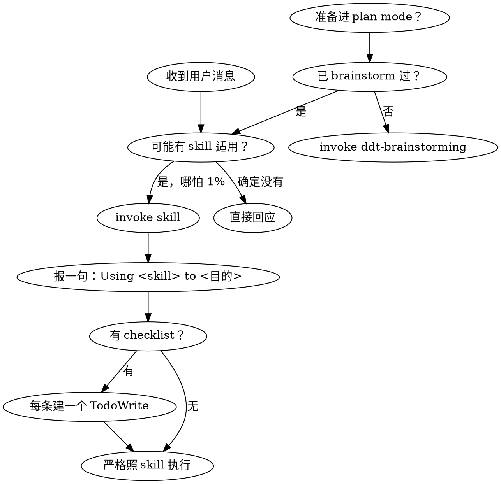

# using-ddt（DDT 取向）

DDT 在 superpowers 边上：不替代它、不垄断入口、不发明第二套项目管理。
superpowers 的 `brainstorming → writing-plans → implementation → review` 是微观主链路。你能读到这段话 = DDT 的 SessionStart inject 在工作。

## 四句北极星

- 大需求先变小。
- 小问题用 superpowers 做深。
- 设计进计划前过闸。
- 需要交付时再收口。

## 三种入口（解释，不是强制路由）

1. **开发者局部想法** → 直接 superpowers 原生链路。bug / 重构 / 测试补强 / 性能 / 探索都走这条。
2. **大需求** → 先跑一条 superpowers 链路把它当**文档资产**实现，产 `docs/requirements/` + `docs/briefs/`，再逐个处理。
3. **brief 驱动** → brief → brainstorming → Design Checkpoint → writing-plans → implementation → review。

不是所有工作都要 requirements/briefs，也不是所有工作都要 verification/delivery。右尺寸。

## 四项增强 → 用什么

- **大需求变小**：用现有 vendored 链路产 requirements/briefs。**implementation 的对象可以是文档/契约/设计/测试资产，不必是代码。** 无需专门 skill。
- **小问题做深**：直接 vendored 链路。
- **设计进计划前过闸**：`ddt-design-checkpoint`。
- **需要交付时再收口**：`ddt-deliver`（按需）。

## Design Checkpoint（七问习惯，无固定模板/文件名）

任何设计进下一落地阶段前（brief 的 `writing-plans` / 大需求逐片深做前），留下最小判断：

1. 是否可进下一阶段？
2. 影响 `docs/api/`？
3. 影响 `docs/data/`？
4. 影响 `docs/design/`？
5. 需写 `.ddt/decisions.jsonl`？
6. 需写 `.ddt/changelog.jsonl`？
7. 有未解决冲突/开放问题？

> 含前端？→ 看 `docs/design/frontend/`（非空 + 有无 opt-out）；空且无 opt-out 则先 `ddt-design-source` 外部整体设计一次（见该 skill）。

简单工作几行写进 spec 末尾即可；复杂工作交 `ddt-design-checkpoint` 整理并按需落 `docs/api,data,design`。**已完成 Checkpoint 就不必为调而调。**

## 路径即指令（唯一权威位置，勿自由发挥）

| 用途 | 路径 | 性质 |
|---|---|---|
| design spec | `docs/specs/` | 主链路常用 |
| plan | `docs/plans/` | 主链路常用 |
| reviewer 证据 | `docs/reviews/*.json` | IL-5 校验对象 |
| 大需求 / 切片输入 | `docs/requirements/`、`docs/briefs/` | 按需 |
| 契约 / 数据 / 设计 | `docs/api/`、`docs/data/`、`docs/design/` | 按需 |
| 前端设计 bundle | `docs/design/frontend/` | 锚点：非空=有 bundle、消费端读这、opt-out 记 decision |
| 验收 / 交付 | `docs/verification/`、`docs/delivery/` | 按需 |
| 决策 / 变更账本 | `.ddt/decisions.jsonl`、`.ddt/changelog.jsonl` | 入 git，仅经 append bin 追加 |
| 状态 / 度量 | `.ddt/state/`、`.ddt/metrics/` | transient，不入 git |

不确定写哪里：跑 `ddt-doctor.mjs` 看 [B] 段——doctor 是真相。

> **bin 脚本怎么跑**：`ddt-doctor.mjs` / `ddt-status.mjs` / `ddt-decisions-append.mjs` / `ddt-changelog-append.mjs` / `ddt-report.mjs` 等由 Claude Code 自动加入 PATH，**一律裸名直接执行**（cwd 无关）。别加 `node` 前缀、别加 `bin/` 路径、别用 `${CLAUDE_PLUGIN_ROOT}`（它不在 Bash 环境里）。

## 如何用 skill（DDT 力量的来源，最高优先级）

DDT 的纪律不靠 hook，靠**让正确的 skill 真的被 invoke**。整套机制照搬 superpowers：

### 铁律

**任何回应或动作之前，先 invoke 相关或被点名的 skill。哪怕只有 1% 可能某 skill 适用，你就绝对必须先 invoke 它检查一下。** invoke 后发现不适用，再放弃即可。这不是可选项，你没有选择权，也不能合理化绕过。

优先级：**用户显式指令 > skill / 本取向 > 默认行为**。但用户指令说的是 **WHAT，不是 HOW**——"加个 X""修个 Y" 不等于"跳过工作流"；只有用户**显式**说"别用 TDD"之类才算豁免。

### 决策流



### DDT 最常踩空的触发点（中招即停，先 invoke 再动手）

- 要"造东西"（建功能 / 加能力 / 改行为 / 起项目）→ 先 `ddt-brainstorming`
- 撞上 bug / 测试失败 / 异常行为 → 先 `ddt-systematic-debugging`
- **进入前端实现前** → 先用 `ddt-design-source` 把整盘前端审美在外部工具设计成 bundle（落 `docs/design/frontend/`，切片直接消费；粒度按项目判断）
- 写实现代码前 → `ddt-tdd`
- 有 spec / 计划要拆 → `ddt-writing-plans`；执行计划 → `ddt-subagent-driven` 或 `ddt-executing-plans`
- 要声明"完成 / 通过 / 修好了" → 先 `ddt-verification`（证据先于断言）
- 收 / 发 review → `ddt-receiving-review` / `ddt-requesting-review`

进入某 skill 后，按它结尾指示**接力 invoke 下一个**——`brainstorming → writing-plans → 实现 → review` 就是这样自动串起来的。

### 别给自己找借口（Red Flags）

下面这些念头一冒出来 = 你正在合理化"跳过 skill"，立刻停：

| 念头 | 现实 |
|---|---|
| "这只是个简单问题" | 问题也是任务，先 check skill |
| "我得先补点上下文" | skill check 在澄清提问之前 |
| "我先探一下代码库" | skill 会告诉你怎么探，先 check |
| "我快速看下 git / 文件" | 文件没有对话上下文，先 check skill |
| "我先收集点信息" | skill 会告诉你怎么收集 |
| "这个不至于动用正式 skill" | 有对应 skill 就用 |
| "我记得这 skill 讲啥" | skill 会演进，invoke 读当前版 |
| "这不算一个任务" | 动作 = 任务，check skill |
| "这 skill 杀鸡用牛刀" | 简单会变复杂，用它 |
| "我就先做这一件事" | 做任何事之前先 check |
| "这感觉挺有产出的" | 无纪律的瞎忙浪费时间 |
| "我知道这词什么意思" | 懂概念 ≠ 用了 skill，invoke 它 |

### skill 优先级

多个 skill 都可能适用时：① **流程 skill 先**（brainstorming、debugging——决定怎么入手）；② **实现 skill 后**（执行）。
"建 X" → 先 `ddt-brainstorming`，再实现 skill。"修 bug" → 先 `ddt-systematic-debugging`，再领域 skill。

### skill 两类

- **刚性**（TDD、debugging）：严格照做，别把纪律适配没了。
- **柔性**（模式类）：按情境调整原则。

skill 自己会告诉你它属哪类。

**唯一不可商量的硬骨头**：reviewer **用 Write 整份写** `docs/reviews/<task-id>-<role>.json`（role ∈ `spec|quality|final`；勿用 Edit 增量改——hook 只校验完整 content）时，结构须为

```json
{ "task_id": "...", "reviewer_role": "spec|quality|final", "verdict": "PASS|FAIL",
  "cited_evidence": ["文件:行 / 命令输出 / 测试名，PASS 时 ≥1 条"],
  "issues": [{ "severity": "critical|important|minor", "where": "文件:行", "note": "..." }],
  "ts": "ISO8601" }
```

`verdict=PASS` 时 `cited_evidence` 必须非空，否则 PreToolUse hook 拦截。其余都是原则，不是闸机。

## 按需协作 & 收口

- **多人/多切片**：每切片在 `slice/<id>` branch 开发并 `git push -u`，`/ddt-status` 跑 `git for-each-ref` 反推「在做谁」。git branch 是 ground truth，非强制。
- `.ddt/decisions.jsonl`、`.ddt/changelog.jsonl`、`.ddt/metrics/*.jsonl` 已配 `.gitattributes merge=union` 自动合并并发追加。
- **收口**（`ddt-deliver`）只在需要时：多实现汇合、toB 验收、部署、数据迁移、API/data/design 变更、客户交付说明、回滚/交付证据。小修小改不强制。
