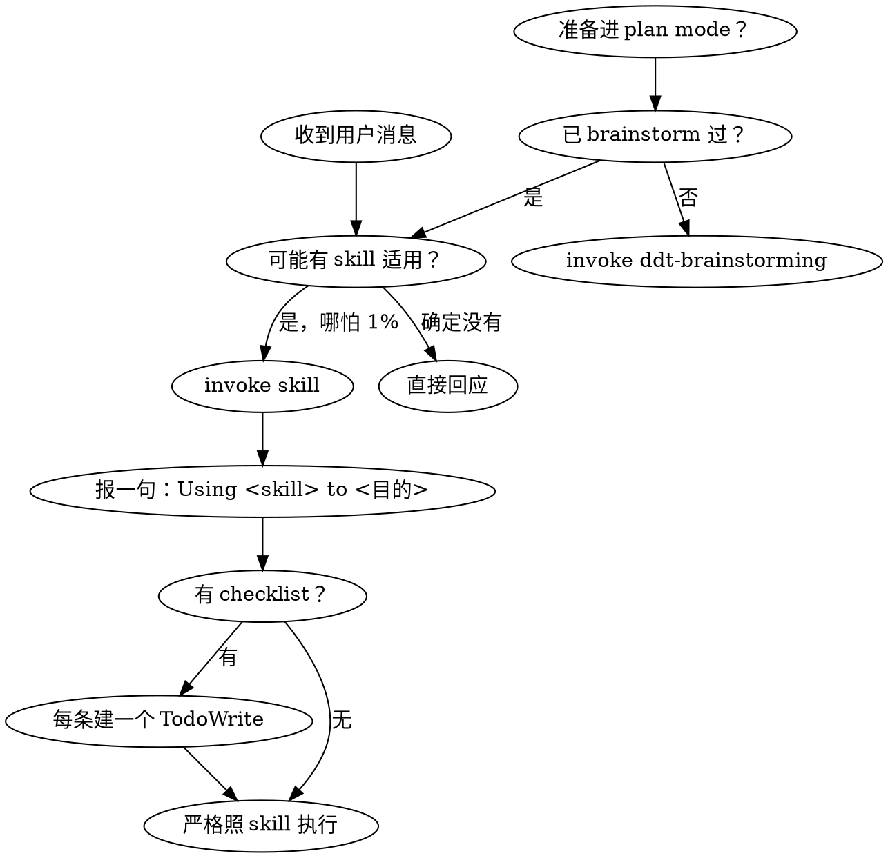

<SUBAGENT-STOP>
If you were dispatched as a subagent to execute a specific task, skip this skill.
</SUBAGENT-STOP>

# using-ddt（DDT 取向）

DDT = superpowers 工程纪律基底 + 四项治理增强。vendoring 同款 skill（命名 `ddt-*`），独立运行，**DDT 与 superpowers 二选一**。
主链路：`ddt-brainstorming → ddt-design-checkpoint → ddt-writing-plans → 实现 → review`。
你能读到这段话 = SessionStart inject 在主 agent 工作；subagent 上下文不接收 inject——dispatch prompt 需主 agent 传递关键纪律（清单见 `ddt-subagent-driven`）。

> **命名空间裁决**：本会话装的是 DDT。所有 skill invoke 一律走 `disciplined-delivery-toolkit:ddt-*`——即便用户口语提"superpowers 流程"也指本套 vendored skill，不是要切换命名空间。

## 四句北极星

- 大需求先变小。
- 小问题用主链路做深。
- 设计进计划前过闸。
- 需要交付时再收口。

## skill 纪律（DDT 力量的来源，最高优先级）

DDT 没有拦截 hook、没有强制层；纪律完全靠**让正确的 skill 真的被 invoke**。

### 铁律

<EXTREMELY-IMPORTANT>

任何回应或动作之前，先 invoke 相关或被点名的 skill。哪怕只有 1% 可能某 skill 适用，绝对必须先 invoke 它检查一下。invoke 后发现不适用，再放弃即可。

如果有 skill 适用你的任务，**你没有选择权，必须用它**。这不是可商量、不可选项、不能合理化绕过。

</EXTREMELY-IMPORTANT>

优先级：**用户显式指令 > skill / 本取向 > 默认行为**。用户指令说的是 **WHAT，不是 HOW**——"加个 X""修个 Y" 不豁免工作流；只有用户**显式**说"别用 TDD"才算豁免。

### 反 self-cert 总规则

**填表 ≠ 走过 skill**。在 spec / plan / 评论里抄一段 checklist 自答 ✅，**不算** invoke 过对应 skill。理由三条：

1. skill 内容会演进，对话里 invoke 才能拿到当前版本——记忆里的 skill 可能已经过时。
2. skill 会按情境追问、按情境改流程，自答无法替代这种交互。
3. skill 答 ✅ 经常意味着要产真实产物（`docs/api/`、测试、决策记录），写在 spec 里只是承诺，不是产出。

具体表现见 Red Flags 里"答完七问表 / 答完 ✅"两条。

### DDT 最常踩空的触发点（中招即停，先 invoke 再动手）

- 收到"一整包"需求（多模块 / 跨人 / 整包资料 PRD-会议纪要-批量 API 文档 / 用户显式说"大需求"）→ 先 `ddt-large-requirement` 把需求变小，再对每个 brief 走 `ddt-brainstorming`
- 想"造东西"（建功能 / 加能力 / 改行为 / 起项目 / 起切片，**输入是单 brief 尺寸**）→ 先 `ddt-brainstorming`
- 撞上 bug / 测试失败 / 异常行为 → 先 `ddt-systematic-debugging`
- 进入前端实现前 → 先 `ddt-design-source` 在外部 AI 设计工具里整盘审美收敛成 bundle（落 `docs/design/frontend/`；粒度按项目判断）
- 写实现代码前 → `ddt-tdd`
- 有 spec / 计划要拆 → `ddt-writing-plans`；执行计划 → `ddt-subagent-driven` 或 `ddt-executing-plans`
- spec 要进 `ddt-writing-plans` → 先过 `ddt-design-checkpoint`（七问表不算）
- 要声明"完成 / 通过 / 修好了" → 先 `ddt-verification`（证据先于断言）
- 收 / 发 review → `ddt-receiving-review` / `ddt-requesting-review`

进入某 skill 后按结尾指示**接力 invoke 下一个**——`brainstorm → checkpoint → writing-plans → 实现 → review` 就是这样自动串起来的。

### 别给自己找借口（Red Flags）

下面这些念头一冒出来 = 你在合理化"跳过 skill"，立刻停：

| 念头 | 现实 |
|---|---|
| "这只是个简单问题" | 问题也是任务，先 check skill |
| "我得先补点上下文" | skill check 在澄清提问之前 |
| "我先探一下代码库 / 看下 git" | 文件没对话上下文；skill 会告诉你怎么探 |
| "这不至于动用正式 skill" / "杀鸡用牛刀" | 简单会变复杂，有对应 skill 就用 |
| "我记得这 skill 讲啥" | skill 演进，invoke 读当前版 |
| "这不算一个任务" / "我就先做这一件事" | 动作 = 任务，先 check |
| "这感觉挺有产出的" | 无纪律的瞎忙浪费时间 |
| "spec 里答完了七问" | 答完表 ≠ invoke 过 `ddt-design-checkpoint` |
| "checkpoint 答 ✅ 就够了" | ✅ 是承诺，不是产出 |
| "右尺寸 = 这次可以不走流程" | "右尺寸"（right-size，按实际需要选规模）是给**精力分配**的——哪些环节按需开；不是给**纪律**开洞——开了的环节就走 skill |

### skill 优先级与刚柔

多 skill 都可能适用时：① **流程 skill 先**（`ddt-brainstorming`、`ddt-systematic-debugging`——决定怎么入手）；② **实现 skill 后**（执行）。
- "建 X" → 先 brainstorming，再实现 skill。
- "修 bug" → 先 systematic-debugging，再领域 skill。

skill 分两类（skill 自己会告诉你属哪类）：
- **刚性**（TDD、debugging）：严格照做，别把纪律适配没了。
- **柔性**（模式类）：按情境调整原则。

## 决策流

## 三种入口（解释，不是强制路由）

1. **开发者局部想法** → 走主链路：想做 X 用 `ddt-brainstorming` 起头，撞 bug 用 `ddt-systematic-debugging`。重构 / 测试补强 / 性能 / 探索都走这条。
2. **大需求** → 先 `ddt-large-requirement` 把大需求变小（产 `docs/requirements/` + `docs/briefs/` + 全局层设计留痕落 `docs/design/`，涵盖架构 / 跨切片业务流程 / 跨切片时序 / 难点算法 / 选型 ADR 等），过完大需求级 checkpoint 后，再对每个 brief 启动 `ddt-brainstorming` 子链路。implementation 对象可以是文档/契约/设计/测试资产，不必是代码。
3. **brief 驱动** → brief → brainstorm → checkpoint → writing-plans → 实现 → review。

不是所有工作都要 requirements/briefs，也不是所有工作都要 verification/delivery。**右尺寸是给精力分配的**——选用哪些环节、产物深到哪一层；**不是给 skill 纪律开洞**——开了的环节就 invoke 对应 skill。

## brainstorming 是主链路起点

"造东西"——建功能 / 加能力 / 改行为 / 起项目 / 起切片——**第一步永远是 `ddt-brainstorming`**，不是直接进 plan、不是先翻代码、不是先问澄清。理由：

- brainstorming 是"想法 → 可执行约束"的唯一入口；跳过它写 plan，plan 就是空中楼阁。
- 哪怕脑子里已有完整方案，invoke 也只多花几十秒，能在你写出来前抓掉 80% 的"自以为想清楚了"。
- brainstorming 结尾会接力到 `ddt-design-checkpoint`——主链路就是靠这种"skill 末尾指下一个"自动串起来。

豁免只有一种：用户**显式**说"跳过 brainstorming"。"小改"、"我心里有数"、"用户口气急"——都不豁免。

## Design Checkpoint（spec → writing-plans 之间过一闸）

spec 落档要进 `ddt-writing-plans`，先过一遍 `ddt-design-checkpoint`。七问内容在那个 skill 里展开，charter 不复制——免得 LLM 在 spec 抄一张表自我认证。

<EXTREMELY-IMPORTANT>

invoke `ddt-design-checkpoint` 才算过闸。spec 里写一张七问表不算。

答 ✅ 产 `docs/api/` / `docs/data/` / `docs/design/` 的，writing-plans 前**真产**，不塞下游 task。

</EXTREMELY-IMPORTANT>

> 含前端？详见下面 "前端落地纲领" 段——bundle handoff 是源权威，项目侧不造导览 markdown。

## 前端落地纲领：bundle handoff = 源权威

凡涉及前端的工作——含前端的 brief 起步 / 写 spec / 过 checkpoint / 写 plan / 实现 / review——都遵守以下两条**全局纲领**，跨 skill 跨阶段一致生效：

1. **bundle 自带的 handoff 入口文件是源权威**。外部设计工具（v0 / figma export / claude-design / Locofy 等）在 bundle 内产的"给 coding agent 的协议说明"是切片消费**唯一入口**——进入实现前必读，再按它的指引消费源码（典型如：直接读 HTML/CSS、follow imports、不截图）。

2. **项目侧不再封装一层 markdown 当导览**。任何项目自造的 `SOURCE.md` / `INDEX.md` / `OVERVIEW.md` 都是反模式——文件类型偏见：LLM 见 markdown 入口本能当 spec、停在转译层、不读真正的源码。bundle handoff 是源权威，项目侧再造的导览是冗余的伪权威。

切片→源文件的"本切片消费哪几份"，写在该切片自己的 brief / spec 内文，**不专设映射文件**（无 `slice-map.json` 之类）。

操作细节——bundle 何时空 / 走 `ddt-design-source` 整盘 / opt-out 怎么记 / checkpoint 怎么看——见 `ddt-design-source` 与 `ddt-design-checkpoint`，本段是**纲领**，它们是**落地**。

## 路径即指令（唯一权威位置，勿自由发挥）

| 用途 | 路径 | 性质 |
|---|---|---|
| design spec | `docs/specs/` | 主链路常用 |
| plan | `docs/plans/` | 主链路常用 |
| 大需求 / 切片输入 | `docs/requirements/`、`docs/briefs/` | 按需 |
| 契约 / 数据 / 设计留痕 | `docs/api/`（接口契约）、`docs/data/`（数据模型）、`docs/design/`（架构 / 业务流程 / 时序图 / 难点算法 / 复杂功能设计 / 选型 ADR 等——凡阅读代码读不出来的设计意图） | 按需 |
| 前端设计 bundle | `docs/design/frontend/` | 非空=有 bundle、消费端读这、opt-out 记 decision |
| 验收 / 交付 | `docs/verification/`、`docs/delivery/` | 按需 |
| 决策 / 变更账本 | `.ddt/decisions.jsonl`、`.ddt/changelog.jsonl` | 入 git，仅经 append bin 追加 |
| 状态 / 度量 | `.ddt/state/`、`.ddt/metrics/` | transient，不入 git |

不确定写哪里：跑 `ddt-doctor.mjs` 看 [B] 段——doctor 是真相。

> **bin 脚本怎么跑**：`ddt-doctor.mjs` / `ddt-status.mjs` / `ddt-decisions-append.mjs` / `ddt-changelog-append.mjs` / `ddt-report.mjs` 等由 Claude Code 自动加入 PATH，**一律裸名直接执行**（cwd 无关）。别加 `node` 前缀、别加 `bin/` 路径、别用 `${CLAUDE_PLUGIN_ROOT}`（它不在 Bash 环境里）。

## 四项治理增强（按需用，不是强制路由）

- **大需求变小**：`ddt-large-requirement` 把大需求拆成 `docs/requirements/` + `docs/briefs/` + 全局层设计留痕（架构 / 流程 / 时序 / 算法 / 选型 ADR 落 `docs/design/`），再对每个 brief 走子链路。implementation 对象是文档/契约/设计/测试资产，不必是代码。
- **小问题做深**：直接主链路。
- **设计进计划前过闸**：`ddt-design-checkpoint`。
- **需要交付时再收口**：`ddt-deliver`（按需）。

## 按需协作 & 收口

- **多人/多切片**：每切片在 `slice/<id>` branch 开发并 `git push -u`，`/ddt-status` 跑 `git for-each-ref` 反推「在做谁」。git branch 是 ground truth，非强制。
- `.ddt/decisions.jsonl`、`.ddt/changelog.jsonl`、`.ddt/metrics/*.jsonl` 已配 `.gitattributes merge=union` 自动合并并发追加。
- **收口**（`ddt-deliver`）只在需要时：多实现汇合、toB 验收、部署、数据迁移、API/data/design 变更、客户交付说明、回滚/交付证据。小修小改不强制。
- **收口前回望**：留给后续切片的接口/扩展点，下游有人消费吗？没把握就记笔决策。
